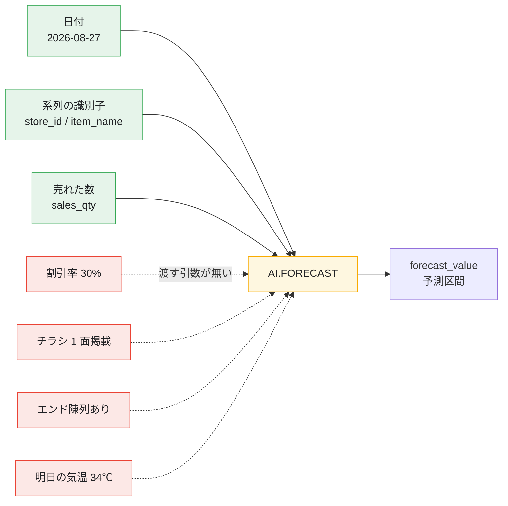
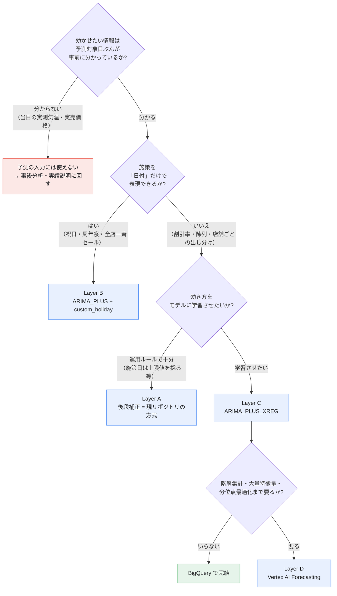
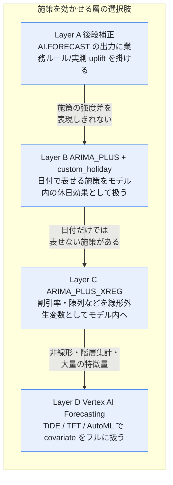
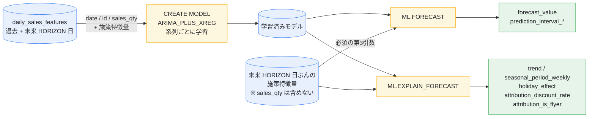
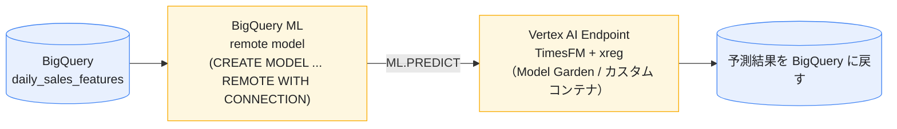

# EXTEND.md — 個別キャンペーン・特別割引を織り込む

[README](README.md) は `AI.FORECAST`（TimesFM）だけで完結する構成です。
[GETTING_STARTED](GETTING_STARTED.md) は、そこに実データを流し込むためのデータ準備を扱っています。

このドキュメントは、その **2 つだけでは対応できない領域** — つまり
「来週の 30% OFF」「チラシ掲載」「エンド陳列」「アプリクーポン」「周年祭」のような
**個別の販促施策を予測に効かせたい**ときに、Google Cloud のどの機能をどう使うか — をまとめたものです。

**時系列予測や BigQuery ML が初めてでも読めるように書いてあります。**
最初の 3 つの章（問題設定・用語・読み方）を読めば、あとは必要なところだけ拾えます。

- [この文書が解決する問題](#この文書が解決する問題)
- [用語ミニ辞典](#用語ミニ辞典)
- [どこから読むか](#どこから読むか)
- [0. 結論と選び方](#0-結論と選び方)
- [1. なぜ `AI.FORECAST` だけでは足りないのか](#1-なぜ-aiforecast-だけでは足りないのか)
- [2. 4 つのレイヤと比較表](#2-4-つのレイヤと比較表)
- [3. 【全レイヤ共通】施策データのモデリング](#3-全レイヤ共通施策データのモデリング)
- [4. Layer A — 予測の後で補正する](#4-layer-a--予測の後で補正する)
- [5. Layer B — 日付で表せる施策を教える](#5-layer-b--日付で表せる施策を教える)
- [6. Layer C — 割引率まで教える](#6-layer-c--割引率まで教える)
- [7. Layer D — Vertex AI にまかせる](#7-layer-d--vertex-ai-にまかせる)
- [8. 番外 — TimesFM を自前で動かす](#8-番外--timesfm-を自前で動かす)
- [9. 施策データを作る・見つけるための道具](#9-施策データを作る見つけるための道具)
- [10. 施策を入れた後の精度検証](#10-施策を入れた後の精度検証)
- [11. 移行の順序（推奨）](#11-移行の順序推奨)

---

## この文書が解決する問題

### まず、具体例で

README のとおり `make forecast` を実行すると、こういう結果が返ってきます。

```
store_id  sales_date   dow  forecast_qty  lower_bound  upper_bound
S01       2026-08-26   Wed          62.4         48.1         79.3
S01       2026-08-27   Thu          58.9         45.0         75.2
S01       2026-08-28   Fri          64.1         49.5         81.0
```

ここで、**8/27（木）に「みんなの納豆 30% OFF・チラシ 1 面掲載」の特売が決まっていた**とします。
その日、店舗 S01 では実際に **180 個**売れました。

| | 値 |
| :--- | ---: |
| 予測値 `forecast_qty` | 58.9 個 |
| 予測区間の上限 `upper_bound` | 75.2 個 |
| **実績** | **180 個** |

**約 3 倍のズレ**です。上限値を採って発注していても、100 個以上の欠品でした。

### なぜこうなるのか

**`AI.FORECAST` に「8/27 に特売をやります」と伝える方法が無いから**です。

`AI.FORECAST` に渡せるのは「**いつ・どの系列が・いくつ売れたか**」という**過去の実績値だけ**で、
「来週こういう販促をやる」という**予定を書く欄がありません**。



### 「特売の日だけ多めに発注すればいいのでは?」

そのとおりで、それが**いまのリポジトリがやっていること**です。
[`sql/12_order_plan.sql`](sql/12_order_plan.sql) は、特売日だけ `forecast_value` ではなく
`prediction_interval_upper_bound`（予測区間の上限値）を採ります。

ただしこの方式には、はっきりした限界があります。

> **上限値は「予測のブレ幅の上端」であって、「特売の効果」ではありません。**

つまり:

- 30% OFF でも 5% OFF でも、**同じ上限値**が使われる
- チラシに載せても載せなくても**同じ**
- 上限値がたまたま予測の 1.28 倍なら、どんな施策も一律 1.28 倍

「30% OFF なら 3 倍、5% OFF なら 1.2 倍」のように、**施策の強さに応じて予測を変えたい**。
そのための選択肢を整理したのが、この文書です。

---

## 用語ミニ辞典

先にここを流し読みしておくと、以降がぐっと読みやすくなります。

| 用語 | このドキュメントでの意味 |
| :--- | :--- |
| **系列**（time series） | 「S01 店の納豆」のような 1 本の時系列。店舗 × 商品で 1 系列。3 店 × 8 商品なら 24 系列 |
| **単変量 / 多変量** | 単変量 = 売上数量という **1 種類の数字の並びだけ**を見る。多変量 = 割引率など**他の列も一緒に**見る |
| **外生変数 / covariate / 特徴量** | 売上を説明するために**外から与える列**（割引率、チラシ有無、気温など）。この 3 語はほぼ同じ意味で使われます。`XREG` は e**X**ternal **REG**ressor（外生回帰変数）の略 |
| **ゼロショット** | 学習（`CREATE MODEL`）**なしで**いきなり予測できること。TimesFM の最大の売り |
| **学習（トレーニング）** | 過去データからモデルのパラメータを決める処理。BigQuery ML では `CREATE MODEL` 文で走ります |
| **予測区間 / `upper_bound`** | 「95% の確率でこの範囲に収まる」という幅。`upper_bound` はその上端 |
| **uplift（上振れ率）** | 平常時の何倍売れたか。特売日 180 個 ÷ 平常 60 個 = **3.0 倍** |
| **バックテスト / ホールドアウト** | 直近 N 日をわざと隠して予測させ、隠した実績と突き合わせる精度確認。`make evaluate` がこれ |
| **attribution（寄与）** | 予測値のうち「**この列のおかげで何個増えたか**」の内訳 |
| **ARIMA** | 昔からある統計的な時系列モデル。BigQuery ML では `ARIMA_PLUS` として使えます。TimesFM と違い**系列ごとに学習が必要** |

> **`AI.FORECAST` と `ML.FORECAST` は別物です。**
> `AI.FORECAST` = TimesFM を呼ぶ関数（学習不要）。
> `ML.FORECAST` = 自分で `CREATE MODEL` したモデルを呼ぶ関数。
> 6 章以降では後者が出てきます。名前が似ているので注意してください。

---

## どこから読むか

| あなたの状況 | 読むところ |
| :--- | :--- |
| 全体像だけ知りたい | [0 章](#0-結論と選び方) と [2 章の比較表](#2-4-つのレイヤと比較表)（5 分） |
| **過去の特売実績データがある** | [3 章](#3-全レイヤ共通施策データのモデリング) → [4 章](#4-layer-a--予測の後で補正する)（モデルは変えない） |
| モデルを変えてもよい | [3 章](#3-全レイヤ共通施策データのモデリング) → [6 章](#6-layer-c--割引率まで教える)（本命の `ARIMA_PLUS_XREG`） |
| Google Cloud の選択肢を比較検討中 | [2 章](#2-4-つのレイヤと比較表) → [7 章](#7-layer-d--vertex-ai-にまかせる) |
| そもそも施策データが無い | [3 章](#3-全レイヤ共通施策データのモデリング) と [9 章](#9-施策データを作る見つけるための道具)。**ここが本当のスタート地点です** |

---

## 0. 結論と選び方

3 行でまとめると:

1. **`AI.FORECAST` には割引率などを渡す引数が存在しません。** これは不具合や設定漏れではなく、
   TimesFM が単変量モデルであることによる仕様です。
2. 施策を効かせる方法は **「予測が出た後ろで補正する」か「モデルを `AI.FORECAST` 以外に替える」**
   の二択しかありません。
3. BigQuery の中だけで済ませたいなら **`ARIMA_PLUS_XREG` が事実上の唯一解**です。
   そのかわり**ゼロショット（学習不要）は捨てる**ことになります。



> **最初の分岐がすべてです。**
> 「予測対象日ぶんの値が**事前に**分かるか」で、使える／使えないが決まります。
> 販促施策は普通「**計画**」なので事前に分かる = 予測に使えます。
> 一方「当日の実測気温」は予測時点では分からないので、どんなモデルを使っても入力にはできません
> （気温**予報**なら使えます）。
> Vertex AI Forecasting はこの区別を **available at forecast / unavailable at forecast** という
> 用語で明示的に扱っています（→ [7 章](#7-layer-d--vertex-ai-にまかせる)）。

---

## 1. なぜ `AI.FORECAST` だけでは足りないのか

README の[引数一覧](README.md#引数)のとおり、`AI.FORECAST` が受け取るのは
`data_col` / `timestamp_col` / `id_cols` / `horizon` / `confidence_level` / `context_window` などだけで、
**説明変数を渡す引数がありません**。

> **`id_cols` があるじゃないか、と思うかもしれません。**
> `id_cols`（このリポジトリでは `store_id` / `item_name`）は
> 「**どこからどこまでが 1 本の系列か**」を区切るためのキーであって、特徴量ではありません。
> ここに `discount_rate` を足しても、「割引率ごとに別の系列」として扱われるだけで、
> 割引率の**大小関係**はモデルに伝わりません。

これは公式ドキュメントの比較表でも明示されています。

| 観点 | `ARIMA_PLUS` / `ARIMA_PLUS_XREG` | TimesFM (`AI.FORECAST`) |
| :--- | :--- | :--- |
| 学習 | 必要（系列ごとに 1 モデル） | **不要**（事前学習済み） |
| SQL の手軽さ | `CREATE MODEL` + 関数呼び出し | **関数 1 本** |
| **covariate 対応** | **`ARIMA_PLUS_XREG` なら可** | **不可** |
| カスタマイズ性 | 高（季節性・休日・段差・外れ値除去…） | 低 |
| 説明性 | 高（`ML.EXPLAIN_FORECAST` で成分分解） | 低 |
| 評価 | `ML.EVALUATE` / `ML.ARIMA_EVALUATE` | `AI.EVALUATE` |

（出典: [Forecasting overview — Compare ARIMA_PLUS models and the TimesFM model](https://cloud.google.com/bigquery/docs/forecasting-overview)）

### 「読み取れるもの」と「読み取れないもの」の線引き

とはいえ TimesFM は無力ではありません。実績値の並びからパターンを**暗黙に**復元するので、
施策のうち**過去に規則的に繰り返されたもの**は間接的に拾えます。

| 施策の性質 | TimesFM が実績値だけから拾えるか |
| :--- | :--- |
| 毎週水曜が定番の特売日 | **拾える**（週次の周期として実績に現れているため） |
| 毎月 0 のつく日のポイント 5 倍 | 拾えることがある（10 日周期が十分な回数あれば） |
| 今回だけの 30% OFF | **拾えない** |
| 今回だけチラシ 1 面に載せた | **拾えない** |
| 割引率が 10% と 30% で効きが違う | **拾えない**（強さの区別を持てない） |
| 競合店が同日に同カテゴリを特売 | **拾えない** |

つまり **「不定期」「今回限り」「強度に差がある」施策**が、このリポジトリの構成の外側に落ちます。
逆に言えば、**定例の特売しかやっていない店なら、いまの構成のままでかなり戦えます。**

---

## 2. 4 つのレイヤと比較表

対応策を、**手軽な順**に 4 段階に整理します。
下に行くほど精度は上がりますが、そのぶん準備と運用が重くなります。



| | Layer A 後段補正 | Layer B custom_holiday | Layer C `ARIMA_PLUS_XREG` | Layer D Vertex AI Forecasting |
| :--- | :--- | :--- | :--- | :--- |
| ひとことで | 予測が出た**後**に倍率を掛ける | 施策日を「祝日」としてモデルに教える | 割引率を「列」としてモデルに教える | 全部まとめて機械学習に任せる |
| ゼロショット | ✓ 維持 | ✗ `CREATE MODEL` 必要 | ✗ `CREATE MODEL` 必要 | ✗ 学習ジョブ必要 |
| 実装場所 | SQL のみ | SQL のみ | SQL のみ | Vertex AI + BigQuery |
| 表現できる施策 | 日付単位の on/off | 日付単位の on/off（前後の窓付き） | **強度・種類つき**（割引率など） | **強度・種類・静的属性・非線形** |
| 店舗ごとの効き方の差 | 手動でテーブル化 | 系列ごとにモデルが分かれる | **自動で学習** | **自動で学習** |
| 効果の可視化 | 自作 | `ML.EXPLAIN_FORECAST` の `holiday_effect_<名>` | `ML.EXPLAIN_FORECAST` の `attribution_<列名>` | Feature attribution (Sampled Shapley) |
| 未来の施策予定 | 予測後の `JOIN` | `custom_holiday` に含める | **`ML.FORECAST` に必須で渡す** | `available_at_forecast_columns` |
| 主な制約 | 施策の強度を扱えない | 日次/週次かつ **履歴 1 年超**が必須 | 線形。学習コスト。エクスポート不可 | 運用が重い・コスト高 |
| 追加コスト | ほぼゼロ | 学習ぶん | 学習ぶん（系列数に比例） | ノード時間課金 |

> **迷ったら Layer A → Layer C の順です。**
> Layer B は「祝日・周年祭が効く商品」に限れば強力ですが、割引率を扱えないので
> キャンペーン対応としては部分解です。Layer D は明確な要件（階層整合・分位点最適化）が
> 出てきてから検討してください。

---

## 3. 【全レイヤ共通】施策データのモデリング

**どのレイヤを選んでも、ここが最初の作業になります。** そしてここが一番手間がかかります。

現在の [`sql/02_seed_inventory_promotions.sql`](sql/02_seed_inventory_promotions.sql) の `promotions` は
`store_id / item_name / promo_date / promo_name` の 4 列、つまり **「その日が特売かどうか」だけ**です。
「何割引か」「チラシに載せたか」はどこにも入っていません。
Layer C / D に進むなら、これを **強度を持った特徴量** に格上げする必要があります。

### 3-1. 施策マスタに持たせたい列

| 列 | 型 | なぜ要るか |
| :--- | :--- | :--- |
| `store_id` / `item_name` / `promo_date` | — | 系列と日付のキー |
| `promo_type` | `STRING` | `特売` / `クーポン` / `ポイント倍` / `増量` は効き方が違う |
| `discount_rate` | `FLOAT64` | **10% OFF と 40% OFF を同じ扱いにしない**。最も効く 1 列 |
| `is_flyer` | `INT64` (0/1) | チラシ掲載の有無。同じ割引率でも露出で伸びが変わる |
| `flyer_position` | `INT64` | 1 面 / 中面。持てるなら |
| `is_endcap` | `INT64` (0/1) | エンド陳列・平台。店舗判断で入るので実績側にしか無いことも多い |
| `is_competitor_promo` | `INT64` (0/1) | 判明するなら下振れ側の説明に使える |
| `promo_name` | `STRING` | 人間向け。モデルには渡さない |

> **なぜ 0/1 の数値なのか（`BOOL` ではなく）:** モデルは数値として扱うためです。
> `is_flyer = 1` の日は「チラシ効果の係数 × 1」ぶんが予測に足される、という理解でかまいません。
> `promo_type` のような文字列は BigQuery ML が内部で自動的に 0/1 の列に展開してくれますが、
> [6-3](#6-3-施策の寄与を数値で取り出す) の寄与分解を素直に読みたいなら、
> 最初から自分で 0/1 の列に分けておくのが分かりやすいです。

> **過去の施策実績も同じスキーマで持ってください。**
> 「未来の予定」だけあっても、**効き方は過去からしか学習できません**。
> 実務ではここが最大の壁になります（販促計画は Excel、実績は POS、両者が紐づいていない）。

### 3-2. 学習用テーブルは「未来ぶんまで」作る

Layer C / D では、**予測対象日の施策フラグも埋まっている必要があります**。
過去だけの表を作ると `ML.FORECAST` の段階で詰みます。

この SQL がやっていることは 3 つだけです。

1. `GENERATE_DATE_ARRAY` で **過去 `HISTORY_DAYS` 日 〜 未来 `HORIZON` 日**の日付を全部作る
2. それに全「店舗 × 商品」を `CROSS JOIN` して、**穴のない格子**にする
3. そこへ売上実績と施策マスタを `LEFT JOIN` し、**該当が無いところは 0 で埋める**

```sql
-- sql/20_build_features.sql（新規に置くならこの位置）
--
-- daily_sales に施策特徴量を結合し、未来 @HORIZON@ 日ぶんまで行を作る。
-- 未来日は sales_qty が NULL、施策フラグだけが埋まっている状態になる。
CREATE OR REPLACE TABLE `@PROJECT_ID@.@DATASET@.daily_sales_features`
PARTITION BY date
CLUSTER BY store_id, item_name
AS
WITH
  -- 1) 過去 @HISTORY_DAYS@ 日 〜 未来 @HORIZON@ 日の日付をすべて列挙
  calendar AS (
    SELECT d AS date
    FROM UNNEST(GENERATE_DATE_ARRAY(
      DATE_SUB(CURRENT_DATE('@TIMEZONE@'), INTERVAL @HISTORY_DAYS@ DAY),
      DATE_ADD(CURRENT_DATE('@TIMEZONE@'), INTERVAL @HORIZON@ - 1 DAY)
    )) AS d
  ),
  -- 2) 予測したい系列（店舗 × 商品）の一覧
  series AS (
    SELECT DISTINCT store_id, item_name
    FROM `@PROJECT_ID@.@DATASET@.daily_sales`
  )
SELECT
  c.date,
  s.store_id,
  s.item_name,
  -- 実績。未来日と欠測日は NULL ではなく 0 / NULL を用途で使い分ける
  -- （→ GETTING_STARTED.md 2 章「欠測日の 0 埋め」「欠品日の補正」）
  a.sales_qty,
  -- 3) ここから下が施策特徴量。過去も未来も必ず値が入る（NULL を残さない）
  IF(p.promo_date IS NULL, 0, 1)      AS is_promo,
  COALESCE(p.discount_rate, 0.0)      AS discount_rate,
  COALESCE(p.is_flyer, 0)             AS is_flyer,
  COALESCE(p.is_endcap, 0)            AS is_endcap
FROM calendar AS c
CROSS JOIN series AS s
LEFT JOIN `@PROJECT_ID@.@DATASET@.daily_sales` AS a
  ON  a.date = c.date AND a.store_id = s.store_id AND a.item_name = s.item_name
LEFT JOIN `@PROJECT_ID@.@DATASET@.promotions_history` AS p
  ON  p.promo_date = c.date AND p.store_id = s.store_id AND p.item_name = s.item_name;
```

できあがるテーブルはこういう形です（`HORIZON=7`、今日が 2026-08-26 の場合）。

| date | store_id | item_name | sales_qty | is_promo | discount_rate | is_flyer | is_endcap |
| :--- | :--- | :--- | ---: | ---: | ---: | ---: | ---: |
| 2026-08-24 | S01 | みんなの納豆 | 61 | 0 | 0.0 | 0 | 0 |
| 2026-08-25 | S01 | みんなの納豆 | 58 | 0 | 0.0 | 0 | 0 |
| **2026-08-26** | S01 | みんなの納豆 | **NULL** | 0 | 0.0 | 0 | 0 |
| **2026-08-27** | S01 | みんなの納豆 | **NULL** | **1** | **0.3** | **1** | **1** |
| 2026-08-28 | S01 | みんなの納豆 | NULL | 0 | 0.0 | 0 | 0 |

今日（8/26）以降は `sales_qty` が `NULL` = まだ売れていない。
一方で **8/27 の施策予定だけはちゃんと埋まっている**。これが Layer C / D に必要な形です。

> **`COALESCE` を省かないこと。** `ARIMA_PLUS_XREG` は特徴量の `NULL` を
> **「そのデータ列全体の平均値」で埋めます**。多系列で学習していると
> *他店舗・他商品の値が混ざった平均*が入り、単一系列で学習したときと結果がずれます。
> 公式ドキュメントも「`CREATE MODEL` の前に自分で補完しておくのがベストプラクティス」としています。

> **Makefile を触るときの注意（[CLAUDE.md](CLAUDE.md) と同じ話）:**
> 新しいプレースホルダを足したら、**変数定義と `RENDER` の `-e` 行の両方**を更新してください。
> 上の例は `@HISTORY_DAYS@` / `@HORIZON@` / `@TIMEZONE@` と、既存の変数だけで書いてあります。

---

## 4. Layer A — 予測の後で補正する

> **モデルは `AI.FORECAST`（TimesFM）のまま。ゼロショットを維持したい人向け。**

現リポジトリの [`sql/12_order_plan.sql`](sql/12_order_plan.sql) は
「特売日は `prediction_interval_upper_bound` を採る」という **固定ルール**です。
モデルを差し替えずに精度を上げるなら、この部分を**過去実績から実測した倍率**に置き換えます。

### 4-1. 上振れ率（uplift）を実測する

考え方はシンプルです。

> 「同じ店・同じ曜日で、**特売じゃない日**は平均何個売れているか」を出し、
> 「**特売の日**はその何倍だったか」を数える。

同一店舗・同一曜日の**前後 4 週**を平常時ベースラインとしています
（前後 4 週 = 同じ曜日で 8 回ぶん。季節変化に追随しつつ、1 回の異常値には引きずられない幅）。

```sql
-- sql/21_measure_uplift.sql
CREATE OR REPLACE TABLE `@PROJECT_ID@.@DATASET@.promo_uplift` AS
WITH joined AS (
  SELECT
    s.date, s.store_id, s.item_name, s.sales_qty,
    p.promo_type,
    p.discount_rate,
    -- 施策日そのものを NULL にしてから移動平均を取る＝平常時だけの水準になる
    AVG(IF(p.promo_date IS NULL, s.sales_qty, NULL)) OVER (
      PARTITION BY s.store_id, s.item_name, EXTRACT(DAYOFWEEK FROM s.date)
      ORDER BY s.date
      ROWS BETWEEN 4 PRECEDING AND 4 FOLLOWING
    ) AS baseline_qty
  FROM `@PROJECT_ID@.@DATASET@.daily_sales` AS s
  LEFT JOIN `@PROJECT_ID@.@DATASET@.promotions_history` AS p
    ON  p.promo_date = s.date
    AND p.store_id   = s.store_id
    AND p.item_name  = s.item_name
)
SELECT
  store_id,
  item_name,
  promo_type,
  -- 割引率は帯にまとめる（10% 刻み）。生の値だと1点ずつになって統計にならない
  CAST(FLOOR(discount_rate * 10) AS INT64) * 10 AS discount_band_pct,
  COUNT(*) AS n_observations,
  -- 平均ではなく中央値。1 回の異常値に引きずられないため
  ROUND(APPROX_QUANTILES(sales_qty / baseline_qty, 2)[OFFSET(1)], 3) AS uplift_ratio
FROM joined
WHERE promo_type IS NOT NULL
  AND baseline_qty > 0
GROUP BY store_id, item_name, promo_type, discount_band_pct
-- 観測回数が少ない組み合わせは信用しない
HAVING n_observations >= 3;
```

結果はこうなります。

| store_id | item_name | promo_type | discount_band_pct | n_observations | uplift_ratio |
| :--- | :--- | :--- | ---: | ---: | ---: |
| S01 | みんなの納豆 | 特売 | 10 | 8 | 1.42 |
| S01 | みんなの納豆 | 特売 | 30 | 5 | **3.02** |
| S01 | みんなの納豆 | クーポン | 20 | 4 | 1.61 |
| S02 | みんなの納豆 | 特売 | 30 | 5 | 2.10 |

読み方:

- S01 で 30% OFF をやると、平常日の **約 3 倍**売れる。10% OFF なら 1.4 倍。
  **割引率で効きがまるで違う**ことが数字で出ます。
- **同じ 30% OFF でも S01 は 3.02 倍、S02 は 2.10 倍。** 店舗によって効き方が違います。
  一律の上限値ではこの差を表現できません。
- `n_observations` が 3 未満の組み合わせは `HAVING` で落としています。
  2 回しか観測がない倍率を発注に使うのは危険なためです。

### 4-2. 発注ロジックに組み込む

`12_order_plan.sql` の `needed_qty` の定義を差し替えます。

```sql
    -- 変更前: 特売日は上限値、通常日は予測値
    -- IF(p.promo_date IS NULL, f.forecast_value, f.upper_bound) AS needed_qty

    -- 変更後: 実測 uplift を掛け、観測が足りない組み合わせだけ従来ルールにフォールバック
    CASE
      WHEN p.promo_date IS NULL          THEN f.forecast_value
      WHEN u.uplift_ratio IS NOT NULL    THEN f.forecast_value * u.uplift_ratio
      ELSE f.upper_bound
    END AS needed_qty
```

冒頭の例に当てはめると、8/27 の必要数量は
`58.9 × 3.02 = 177.9 個` — 実績 180 個に対してほぼ一致します。
上限値 75.2 個とは比べものになりません。

### 4-3. この方式の限界（重要）

- **二重計上のリスク。** 過去の特売実績が `daily_sales` にそのまま入っていると、
  TimesFM はその山も含めた水準を学習しています。そこへさらに uplift を掛けると過大発注になります。
  厳密にやるなら **「施策の影響を除いた系列で予測 → 出力側で施策分を戻す」**
  （README の[外部要因の表](README.md#外部要因特売天候祝日を効かせたいとき)の 2 番目の方式）を採ってください。
  `21_measure_uplift.sql` の `baseline_qty` はそのまま「均した系列」として `AI.FORECAST` に流せます。
- **施策の重なりを扱えない。** チラシ × エンド × クーポンが同日に来たとき、
  倍率を掛け算してよい保証はありません（普通は掛け算より小さくなります）。
- **新商品・新店舗に効かない。** 実測できる履歴がないため。
- **組み合わせが増えると表が破綻する。** 店舗 × 商品 × 施策種別 × 割引帯 で
  行数が掛け算で膨らみ、それぞれに 3 回以上の観測が必要になります。

これらが気になり始めたら、**モデル自身に学習させる** Layer C に進む合図です。

---

## 5. Layer B — 日付で表せる施策を教える

> **`ARIMA_PLUS` の「カスタム休日」機能を使います。特徴量テーブルの準備が不要な、いちばん軽いモデル内対応。**

### 5-0. なぜ「休日」がキャンペーンに使えるのか

`ARIMA_PLUS` には「**祝日効果**」という仕組みがあります。
「毎年この日はいつもより売れる／売れない」というパターンを、**日付を指定するだけ**で
モデルに学習させられる機能です。

ここで重要なのは、**この「休日」は世間の祝日である必要がない**という点です。
`custom_holiday` として自社の周年祭やイベント日を登録すれば、
モデルは同じ仕組みで「この日はいつもと違う」を学習してくれます。

つまり **「毎年やる定例キャンペーン」を疑似的な祝日として扱える**、というのが Layer B です。

### 5-1. 組み込みの日本の祝日

`HOLIDAY_REGION` は `'JP'`（日本）と `'JAPAC'`（日本・アジア太平洋）を含む約 60 の地域コードを取ります。
これを付けるだけで、日本の祝日カレンダーが自動で適用されます。

```sql
CREATE OR REPLACE MODEL `@PROJECT_ID@.@DATASET@.demand_arima`
OPTIONS (
  model_type                = 'ARIMA_PLUS',
  time_series_timestamp_col = 'date',
  time_series_data_col      = 'sales_qty',
  time_series_id_col        = ['store_id', 'item_name'],
  data_frequency            = 'DAILY',
  holiday_region            = 'JP',
  horizon                   = @HORIZON@
) AS
SELECT date, store_id, item_name, sales_qty
FROM `@PROJECT_ID@.@DATASET@.daily_sales`
WHERE item_name = '@ITEM_NAME@';
```

> **`time_series_id_col` を指定すると、系列ごとにモデルが自動で分かれます。**
> `CREATE MODEL` 文は 1 本ですが、3 店舗ぶんなら内部で 3 つのモデルが作られます。
> 自分でループを書く必要はありません。

### 5-2. 自社イベントを custom_holiday で足す

`AS` 句を `(training_data AS (...), custom_holiday AS (...))` の形にすると、
**組み込み祝日に加えて任意の日付**を休日としてモデリングできます。

```sql
CREATE OR REPLACE MODEL `@PROJECT_ID@.@DATASET@.demand_arima_custom`
OPTIONS (
  model_type                = 'ARIMA_PLUS',
  time_series_timestamp_col = 'date',
  time_series_data_col      = 'sales_qty',
  time_series_id_col        = ['store_id', 'item_name'],
  data_frequency            = 'DAILY',
  holiday_region            = 'JP',       -- 組み込みの日本の祝日も併用する
  horizon                   = @HORIZON@
) AS (
  training_data AS (
    SELECT date, store_id, item_name, sales_qty
    FROM `@PROJECT_ID@.@DATASET@.daily_sales`
    WHERE item_name = '@ITEM_NAME@'
  ),
  custom_holiday AS (
    -- holiday_name は ML.EXPLAIN_FORECAST の列名になるので、空白なしの識別子にする
    SELECT
      'JP'              AS region,
      'AnniversaryFair' AS holiday_name,
      primary_date,
      2 AS preholiday_days,    -- 前 2 日から効果が立ち上がる
      1 AS postholiday_days    -- 後 1 日まで効果を引きずる
    FROM UNNEST([
      DATE('2024-10-05'), DATE('2025-10-04'), DATE('2026-10-03')
    ]) AS primary_date
  )
);
```

> **`preholiday_days` / `postholiday_days` が地味に効きます。**
> 周年祭の前日から買い控えが起き、翌日は反動で落ちる — といった
> **前後への染み出し**を、当日だけのフラグでは表現できません。
> 未来ぶんの日付（上の例では 2026-10-03）も **`custom_holiday` に入れておく必要があります**。
> 過去の日付だけだと、学習はできても予測時に適用されません。

効果の確認:

```sql
-- どの休日がモデルに入ったか
SELECT * FROM ML.HOLIDAY_INFO(MODEL `@PROJECT_ID@.@DATASET@.demand_arima_custom`);

-- 施策ごとの寄与を数値で取り出す
SELECT
  store_id, item_name, time_series_timestamp,
  holiday_effect,
  holiday_effect_AnniversaryFair
FROM ML.EXPLAIN_FORECAST(
  MODEL `@PROJECT_ID@.@DATASET@.demand_arima_custom`,
  STRUCT(@HORIZON@ AS horizon, @CONFIDENCE_LEVEL@ AS confidence_level))
WHERE holiday_effect != 0;
```

### 5-3. 落とし穴

| 制約 | 内容 |
| :--- | :--- |
| **履歴 1 年超が必須** | 休日効果モデリングは **日次または週次、かつ 1 年より長い**系列にしか適用されません。条件を満たさないと `holiday_region` を指定しても**黙って無視されます**（エラーになりません）。このリポジトリの既定 `HISTORY_DAYS=180` では効きません。試すなら `make setup HISTORY_DAYS=730` |
| 有効期間 | 休日効果は **約 5 年ぶん**しか効かないとされています |
| `custom_holiday` の行数 | 50,000 行以下 |
| 店舗ごとの出し分け | できません。`region` は系列ではなく地域単位です。店舗ごとにイベント日が違うなら Layer C へ |
| 強度の差 | 表現できません。「割引 10%」と「割引 40%」を区別したいなら Layer C へ |
| エクスポート | `ARIMA_PLUS` / `ARIMA_PLUS_XREG` モデルは **エクスポート不可** |

---

## 6. Layer C — 割引率まで教える

> **`ARIMA_PLUS_XREG`。BigQuery の中だけで「個別キャンペーン・特別割引」に対応する本命です。**

`ARIMA_PLUS` に**外生変数**（＝割引率やチラシ有無の列）を足したモデルです。
「時系列としての動き（トレンド・曜日・季節・祝日）」と「施策の効果」を**分けて**推定してくれます。

やることは 3 ステップです。

1. **学習** — `CREATE MODEL` に、実績値 + 施策特徴量を渡す
2. **予測** — `ML.FORECAST` に、**予測対象日ぶんの施策特徴量**を渡す（ここが `AI.FORECAST` と最大の違い）
3. **確認** — `ML.EXPLAIN_FORECAST` で「どの施策が何個ぶん効いたか」を見る



### 6-1. 学習

`OPTIONS` で指定していない列が、そのまま**外生変数として扱われます**。
下の例では `is_promo` / `discount_rate` / `is_flyer` / `is_endcap` の 4 つです。

```sql
-- sql/22_train_xreg.sql
CREATE OR REPLACE MODEL `@PROJECT_ID@.@DATASET@.demand_xreg`
OPTIONS (
  model_type                = 'ARIMA_PLUS_XREG',
  time_series_timestamp_col = 'date',
  time_series_data_col      = 'sales_qty',
  time_series_id_col        = ['store_id', 'item_name'],
  data_frequency            = 'DAILY',
  horizon                   = @HORIZON@,
  holiday_region            = 'JP',
  -- ★ 既定 TRUE のままだと特売の山を「外れ値」として線形補間で消してしまう。
  --    施策の効果を学習させたいなら必ず FALSE にする（→ 6-4 の 1 番）
  clean_spikes_and_dips     = FALSE
) AS
SELECT
  date, store_id, item_name, sales_qty,
  -- ↓ OPTIONS で役割を指定していない列 = 外生変数
  is_promo, discount_rate, is_flyer, is_endcap
FROM `@PROJECT_ID@.@DATASET@.daily_sales_features`
WHERE item_name = '@ITEM_NAME@'
  AND sales_qty IS NOT NULL;      -- 未来行は学習から外す
```

実行すると、データセットの中に `demand_xreg` という**モデルオブジェクト**ができます
（BigQuery コンソールのデータセット配下に、テーブルと並んで表示されます）。
以後の予測は、このモデルを参照して行います。**`AI.FORECAST` と違い、この成果物の管理が発生します。**

### 6-2. 予測（未来の施策予定が必須）

`ML.FORECAST` の第 3 引数に、**予測対象日ぶんの特徴量**を渡します。
`AI.FORECAST` と違い「モデルに投げるだけ」では動きません。

```sql
-- sql/23_forecast_xreg.sql
SELECT
  store_id,
  item_name,
  DATE(forecast_timestamp)                  AS sales_date,
  FORMAT_DATE('%a', DATE(forecast_timestamp)) AS dow,
  ROUND(forecast_value, 1)                  AS forecast_qty,
  ROUND(prediction_interval_lower_bound, 1) AS lower_bound,
  ROUND(prediction_interval_upper_bound, 1) AS upper_bound
FROM ML.FORECAST(
  MODEL `@PROJECT_ID@.@DATASET@.demand_xreg`,
  STRUCT(@HORIZON@ AS horizon, @CONFIDENCE_LEVEL@ AS confidence_level),
  (
    -- 予測対象日ぶん。data_col（sales_qty）は含めない
    SELECT date, store_id, item_name, is_promo, discount_rate, is_flyer, is_endcap
    FROM `@PROJECT_ID@.@DATASET@.daily_sales_features`
    WHERE item_name = '@ITEM_NAME@'
      AND date >= CURRENT_DATE('@TIMEZONE@')
      AND date <  DATE_ADD(CURRENT_DATE('@TIMEZONE@'), INTERVAL @HORIZON@ DAY)
  ))
ORDER BY store_id, sales_date;
```

> **ここが Layer A/B と決定的に違う点です。**
> 「8/27 は 30% OFF でチラシ 1 面」という**予定を入力として渡している**ので、
> モデルはその日だけ跳ね上がった予測を返します。
> 逆に言えば、**予定が埋まっていない日は施策なしとして予測されます**（→ 6-4 の 4 番）。

> 引数の順序は公式チュートリアル（[Forecast multiple time series with a multivariate model](https://cloud.google.com/bigquery/docs/arima-plus-xreg-multiple-time-series-forecasting-tutorial)）の
> **`MODEL` → `STRUCT` → 未来特徴量** に合わせています。`ML.EXPLAIN_FORECAST` も同じ順序です。

### 6-3. 施策の寄与を数値で取り出す

`ML.EXPLAIN_FORECAST` は、外生変数ごとに `attribution_<列名>` 列を返します。
値は **回帰係数 × 特徴量の値**（線形モデルなので Shapley 値と一致）です。

```sql
SELECT
  store_id, item_name, time_series_timestamp,
  ROUND(trend, 1)                        AS trend,
  ROUND(seasonal_period_weekly, 1)       AS weekly,
  ROUND(holiday_effect, 1)               AS holiday,
  ROUND(attribution_discount_rate, 1)    AS by_discount,
  ROUND(attribution_is_flyer, 1)         AS by_flyer,
  ROUND(attribution_is_endcap, 1)        AS by_endcap,
  ROUND(time_series_data, 1)             AS total
FROM ML.EXPLAIN_FORECAST(
  MODEL `@PROJECT_ID@.@DATASET@.demand_xreg`,
  STRUCT(@HORIZON@ AS horizon, @CONFIDENCE_LEVEL@ AS confidence_level),
  (SELECT date, store_id, item_name, is_promo, discount_rate, is_flyer, is_endcap
   FROM `@PROJECT_ID@.@DATASET@.daily_sales_features`
   WHERE item_name = '@ITEM_NAME@' AND date >= CURRENT_DATE('@TIMEZONE@')))
WHERE time_series_type = 'forecast';
```

冒頭の例（S01 の納豆、8/27 に 30% OFF + チラシ 1 面 + エンド陳列）だと、こう返ります。

| time_series_timestamp | trend | weekly | holiday | by_discount | by_flyer | by_endcap | **total** |
| :--- | ---: | ---: | ---: | ---: | ---: | ---: | ---: |
| 2026-08-26 | 55.0 | +3.1 | 0.0 | 0.0 | 0.0 | 0.0 | **58.1** |
| **2026-08-27** | 55.2 | +2.4 | 0.0 | **+98.6** | **+15.1** | **+9.2** | **180.5** |
| 2026-08-28 | 55.4 | +6.8 | 0.0 | 0.0 | 0.0 | 0.0 | **62.2** |

読み方:

- **横に足すと `total` になります。** `55.2 + 2.4 + 0 + 98.6 + 15.1 + 9.2 = 180.5`
- 8/27 の 180.5 個のうち、**98.6 個は割引の効果、15.1 個はチラシ、9.2 個はエンド陳列**。
  つまり「施策をやらなければ 57.6 個だった」ということが数字で言えます。
- `by_discount` は `discount_rate = 0.30` に対する値なので、学習された係数は
  `98.6 ÷ 0.30 ≈ 329`。**「割引率 1 ポイント（1%）につき約 3.3 個」**という読み方ができます。

> **これが `AI.FORECAST` に対する最大の実務的アドバンテージです。**
> 「なぜこの発注数なのか」を人に説明できます。
> 発注担当者への説明にも、施策の費用対効果の議論にもそのまま使えます。

### 6-4. 落とし穴（これを知らないと必ず踏む）

| # | 落とし穴 | 対処 |
| :--- | :--- | :--- |
| 1 | **`CLEAN_SPIKES_AND_DIPS` が既定 `TRUE`** | 特売日の山を外れ値と判定して局所線形補間で潰します。**外生変数に学習させたいはずの山を、前処理が先に消してしまう**という最悪の組み合わせ。`FALSE` を明示してください |
| 2 | **`ADJUST_STEP_CHANGES` も既定 `TRUE`** | 価格改定・改装などの段差を吸収します。段差そのものを説明変数で扱いたいなら `FALSE` を検討 |
| 3 | **特徴量の `NULL` は「全データ列の平均」で補完される** | 多系列だと他系列の値が混ざります。`COALESCE` で自分で埋めてから投入（→ [3-2](#3-2-学習用テーブルは未来ぶんまで作る)） |
| 4 | **未来の特徴量が無いと予測できない** | 施策予定が確定していない日は `is_promo = 0` などの既定値で埋める。埋め忘れると 3 番の挙動に落ち、**やってもいない特売の効果が乗ります** |
| 5 | **線形のみ** | 「割引 40% でも需要は頭打ち」のような飽和は表現できません。`discount_rate` を帯（バンド）に切って複数のダミー列にすると擬似的に扱えます |
| 6 | **学習コストが系列数に比例** | 公式チュートリアルは約 100 万系列で **38 分**。1 商品 × 3 店舗のデモ規模なら数秒〜数十秒ですが、全 SKU に広げる前に `TIME_SERIES_LENGTH_FRACTION` / `MAX_TIME_SERIES_LENGTH` での高速化を検討 |
| 7 | ゼロショットではなくなる | `CREATE MODEL` の成果物が残るため、**再学習のスケジューリングが必要**になります（→ [9-4](#9-4-パイプライン化)） |
| 8 | エクスポート不可 | `ARIMA_PLUS_XREG` モデルは `EXPORT MODEL` できません |

### 6-5. その他の制約

| 項目 | 値 |
| :--- | :--- |
| 入力系列の長さ | 最小 3 点 / 最大 1,000,000 点 |
| 予測点数 | 最大 10,000 |
| 学習特徴量のカーディナリティ | 最大 10,000 |
| 休日効果の有効期間 | 約 5 年 |

---

## 7. Layer D — Vertex AI にまかせる

> **BigQuery ML の枠を出る選択肢。Vertex AI Forecasting（旧 AutoML Forecasting）は、施策の扱いが最も体系化されています。**

### 7-1. 3 つの特徴量タイプ

Vertex AI は、列を次の 3 種に分類させます。
[0 章](#0-結論と選び方)の「事前に分かるか」という分岐が、そのまま API の設計になっています。

| Vertex AI の分類 | API フィールド | 意味 | 本リポジトリでの該当 |
| :--- | :--- | :--- | :--- |
| **Attribute** | `time_series_attribute_columns` | 時間で変わらない静的属性 | `store_format`（都心型/郊外型）、`category`、`case_lot` |
| **Covariate（available at forecast）** | `available_at_forecast_columns` | 予測対象日ぶんの値が分かる = **先行指標** | **`is_promo` / `discount_rate` / `is_flyer` / `is_endcap` / 祝日 / 気温予報** |
| **Covariate（unavailable at forecast）** | `unavailable_at_forecast_columns` | 予測対象日の値は分からない | 実測気温、実測来店客数、Web の閲覧数 |

**「個別キャンペーン・特別割引」はまさに available at forecast の covariate です。**
Layer A〜C で工夫してきたことが、ここでは API の第一級概念として扱われます。

### 7-2. 学習方式の選択

| 方式 | 特徴 |
| :--- | :--- |
| **TiDE** | Dense エンコーダ・デコーダ。**長いコンテキストと長い horizon で速くて高品質**。まず試すならこれ |
| **TFT**（Temporal Fusion Transformer） | Attention ベース。**解釈性が高い** |
| **AutoML (L2L)** | 幅広いユースケースに無難 |
| **Seq2Seq+** | 探索空間が小さく収束が速い。1 GB 未満の小さいデータや実験向き |

### 7-3. 小売で効く追加機能

- **Hierarchical forecasting** — 「店舗別 × SKU 別」の予測合計を「店舗計」「チェーン計」と整合させる。
  発注（SKU 単位）と仕入計画（センター単位）を同時に回すなら重要。
- **Probabilistic inference + quantiles** — 分位点を最大 5 つ返せます。
  「欠品を避けたいので 90 パーセンタイルで発注する」という運用にそのまま繋がります
  （TiDE と AutoML でのみ利用可、階層予測とは併用不可）。
- **Feature attribution**（Sampled Shapley） — どの covariate がどれだけ効いたかを予測単位で取得。
  `ML.EXPLAIN_FORECAST` と同じことを、非線形モデルに対してもできます。

### 7-4. 現実的な評価

- BigQuery のテーブルを Vertex AI から直接参照できるので、**データの持ち出しは不要**。
- ただし `make forecast` 1 コマンドで済む世界ではなくなります。
  学習ジョブ・モデルレジストリ・バッチ予測ジョブの管理が発生し、**ノード時間で課金**されます。
- **Layer C で足りないと判断してから**移るのが順当です。
  「まず Vertex AI」は、このデモの延長線上ではほぼオーバーキルです。

---

## 8. 番外 — TimesFM を自前で動かす

> **「ゼロショットのまま、施策も効かせたい」という欲張りな要求への回答。ただし運用は重くなります。**

BigQuery の `AI.FORECAST` では不可能ですが、**TimesFM 本体（OSS 実装）には covariate 対応の API があります**。

`timesfm[xreg]` の `forecast_with_covariates()` は次を受け取ります。

| 引数 | 内容 | 小売での例 |
| :--- | :--- | :--- |
| `dynamic_numerical_covariates` | 時間変化する数値 | `discount_rate`、気温予報 |
| `dynamic_categorical_covariates` | 時間変化するカテゴリ | `promo_type`、曜日 |
| `static_categorical_covariates` | 系列ごとに固定のカテゴリ | `store_format`、`category` |
| `xreg_mode` | `'xreg + timesfm'` / `'timesfm + xreg'` | 外生変数を先に処理するか、TimesFM の予測を後から補正するか |

> **dynamic covariate は `context + horizon` ぶんの長さが必要**です。
> ここでも「未来ぶんの施策予定が要る」という制約は Layer C と同じです。

構成としては次のようになります。



- TimesFM（1.0 / 2.0 / 2.5）は **Vertex AI Model Garden からワンクリックでエンドポイントにデプロイ**できます。
- デプロイしたエンドポイントは、BigQuery の Cloud resource connection 経由で
  `CREATE MODEL ... REMOTE WITH CONNECTION ... OPTIONS(ENDPOINT = '...')` として登録し、
  `ML.PREDICT` から SQL で呼べます（＝ SQL からの使い勝手は保てます）。

> **確認が必要な点:** Model Garden の既定サービングコンテナが
> `forecast_with_covariates` 相当のリクエストをそのまま受け付けるかは、デプロイ後に
> エンドポイントの「サンプルリクエスト」で必ず確かめてください。
> 受け付けない場合はカスタム予測コンテナを自作することになり、
> **Layer C（`ARIMA_PLUS_XREG`）より確実に運用が重くなります。**
> ゼロショット性を守るためだけにここへ来る価値があるかは、慎重に判断してください。

---

## 9. 施策データを作る・見つけるための道具

[3 章](#3-全レイヤ共通施策データのモデリング)で「施策マスタが要る」と書きましたが、
**実際にはそんなものは存在しない**——というのが多くの現場の実情です。ここではその埋め方を扱います。

### 9-1. 販促計画書やチラシから構造化データを起こす

販促計画が PDF・Excel・チラシ画像で存在する場合、BigQuery から Gemini を呼んで構造化できます。

```sql
-- 販促計画のフリーテキストを施策マスタの形に落とす
SELECT *
FROM AI.GENERATE_TABLE(
  MODEL `@PROJECT_ID@.@DATASET@.gemini_model`,
  (
    SELECT
      CONCAT('次の販促計画から、対象商品・開始日・終了日・割引率・チラシ掲載有無を抽出してください: ',
             plan_text) AS prompt
    FROM `@PROJECT_ID@.@DATASET@.promo_plan_raw`
  ),
  STRUCT(
    'item_name STRING, start_date STRING, end_date STRING, discount_rate FLOAT64, is_flyer BOOL'
      AS output_schema));
```

抽出結果は**必ず人手でレビューしてから**マスタに入れてください。日付の取り違えは
そのまま発注数の誤りになります。

### 9-2. 外部データを持ってくる

| データ | 入手先 |
| :--- | :--- |
| 祝日 | `bigquery-public-data.ml_datasets.holidays_and_events_for_forecasting`（`WHERE region = 'JP'` で内容を確認できる）。`ARIMA_PLUS` なら `holiday_region = 'JP'` で自動適用 |
| 天候 | BigQuery 一般公開データセットの気象データ。公式の XREG チュートリアルは `bigquery-public-data.covid19_weathersource_com.postal_code_day_history` を使っています |
| 欠測の穴埋め | [`GAP_FILL`](https://cloud.google.com/bigquery/docs/working-with-time-series) テーブル関数（`NULL` / `LOCF` / `LINEAR`） |

### 9-3. 「記録に残っていない施策」を見つける

実務では、**マスタに無いのに明らかに跳ねている日**が必ずあります（店長判断の値引き、テレビ露出など）。
放っておくとモデルにとってはただのノイズですが、`ARIMA_PLUS` 系のモデルから機械的に洗い出せます。

| 関数 | 用途 |
| :--- | :--- |
| `ML.DETECT_ANOMALIES` | 単発のスパイク／ディップを検出。施策マスタと突き合わせて「説明できない山」を洗い出す |
| `ML.DETECT_CHANGE_POINTS` | 構造変化点。改装・棚替え・競合出店の時期の特定に |
| `ML.EXPLAIN_FORECAST` の `spikes_and_dips` | 履歴行に対して、モデルが外れ値と判断した量が入る |

洗い出した日を店舗に確認して施策マスタに追記していく——
これが Layer C の精度を上げる、一番地道で確実な作業です。

### 9-4. パイプライン化

`AI.FORECAST` と違い Layer B / C は学習が要るため、定期実行の設計が必要になります。

| やること | 使うもの |
| :--- | :--- |
| 特徴量テーブルの日次更新 | BigQuery スケジュールクエリ / Dataform |
| モデルの定期再学習 | Dataform / Cloud Composer / Cloud Scheduler + Cloud Run |
| 発注データの配信 | `12_order_plan.sql` 相当の結果をテーブルに保存（`make save` と同じ考え方） |
| 可視化 | Looker Studio（`make history` の出力をそのまま繋げます） |

---

## 10. 施策を入れた後の精度検証

**全期間の MAPE が改善したかだけを見ないでください。**
施策日は日数が少ないので、全体指標にはほとんど現れません。
「施策対応を入れたのに MAPE が 0.3% しか改善しなかった」は、失敗ではなく**見ている指標が悪い**だけです。

```sql
-- 施策日と通常日で分けて誤差を見る
SELECT
  IF(f.is_promo = 1, '施策日', '通常日') AS day_type,
  COUNT(*)                                                            AS n,
  -- MAE: 予測と実績の差の絶対値の平均（単位は「個」なので直感的）
  ROUND(AVG(ABS(a.sales_qty - f.forecast_value)), 2)                  AS mae,
  -- MAPE: 同じものを % で
  ROUND(AVG(ABS(a.sales_qty - f.forecast_value) / a.sales_qty) * 100, 2) AS mape_pct,
  -- bias: 符号付きの平均。プラスなら過大予測、マイナスなら過小予測
  ROUND(AVG(f.forecast_value - a.sales_qty), 2)                       AS bias
FROM backtest_forecast AS f
JOIN `@PROJECT_ID@.@DATASET@.daily_sales` AS a
  USING (date, store_id, item_name)
WHERE a.sales_qty > 0
GROUP BY day_type;
```

見るべき点:

1. **施策日の MAE が下がったか。** ここが改善しないなら施策を入れた意味がありません。
2. **通常日の MAE が悪化していないか。** 外生変数を足すと通常日が犠牲になることがあります。
3. **`bias` の符号。** 欠品コストと廃棄コストは非対称です。納豆のような日配品は
   「わずかに過小」より「わずかに過大」のほうが痛い場合があります。
   どちらに倒すかは業務判断であり、モデルの精度とは別の話です。
4. **ホールドアウトに施策日が含まれているか。** README の `EVAL_HORIZON`（既定 28 日）の考え方と同じで、
   施策日が 1〜2 日しか入っていない期間で判定しないこと。施策日を **最低 10 回**は含めてください。

`AI.FORECAST` との比較は、同じホールドアウトで
`make evaluate`（`AI.EVALUATE`）と `ML.EVALUATE` を並べて実行すれば取れます。

---

## 11. 移行の順序（推奨）

いきなり Layer C / D に飛ばないでください。**多くの場合、精度を決めるのはモデルではなくデータです**
（→ [GETTING_STARTED 2 章](GETTING_STARTED.md#2-実データで必ずハマる-6-点)）。

1. **施策マスタを作る。** 過去 1〜2 年ぶんの「いつ・どの店で・どの商品を・何%引きで・どう露出したか」。
   ここが無い限り、どのレイヤも動きません。**作業量の 8 割はここです。**
2. **[4 章](#4-layer-a--予測の後で補正する)の uplift 実測を回す。** モデルを変えずに、
   現行の固定ルール（特売日は上限値）より良くなるかを見る。ここで十分なら終わり。
3. **`HISTORY_DAYS` を 730 に増やして [Layer B](#5-layer-b--日付で表せる施策を教える) を試す。**
   祝日・季節イベントが効く商品（鍋つゆ・アイスクリーム）で差が出やすい。
4. **[Layer C](#6-layer-c--割引率まで教える) を 1 カテゴリで試す。**
   `clean_spikes_and_dips = FALSE` を忘れずに。`ML.EXPLAIN_FORECAST` で
   `attribution_discount_rate` の符号と大きさが直感と合うかを必ず確認する。
   **符号が逆（割引すると売上が減る）なら、施策マスタか欠品補正が間違っています。**
5. **それでも足りなければ [Layer D](#7-layer-d--vertex-ai-にまかせる)。**
   階層整合や分位点最適化が業務要件として明確にある場合に限る。

---

## 参考リンク

**BigQuery ML**

- [Forecasting overview（TimesFM と ARIMA_PLUS の比較表）](https://cloud.google.com/bigquery/docs/forecasting-overview)
- [`CREATE MODEL` for ARIMA_PLUS_XREG（多変量モデル）](https://cloud.google.com/bigquery/docs/reference/standard-sql/bigqueryml-syntax-create-multivariate-time-series)
- [`CREATE MODEL` for ARIMA_PLUS（`HOLIDAY_REGION` / `custom_holiday`）](https://cloud.google.com/bigquery/docs/reference/standard-sql/bigqueryml-syntax-create-time-series)
- [`ML.FORECAST`](https://cloud.google.com/bigquery/docs/reference/standard-sql/bigqueryml-syntax-forecast) / [`ML.EXPLAIN_FORECAST`](https://cloud.google.com/bigquery/docs/reference/standard-sql/bigqueryml-syntax-explain-forecast) / [`ML.HOLIDAY_INFO`](https://cloud.google.com/bigquery/docs/reference/standard-sql/bigqueryml-syntax-holiday-info)
- [チュートリアル: 多変量モデルで複数時系列を予測（酒類販売 × 天候）](https://cloud.google.com/bigquery/docs/arima-plus-xreg-multiple-time-series-forecasting-tutorial)
- [チュートリアル: ARIMA_PLUS でカスタム休日を使う](https://cloud.google.com/bigquery/docs/time-series-forecasting-holidays-tutorial)
- [BigQuery ML の Explainable AI](https://cloud.google.com/bigquery/docs/xai-overview)
- [`AI.GENERATE_TABLE` で構造化データを生成](https://cloud.google.com/bigquery/docs/generate-table)
- [Vertex AI エンドポイントを remote model として登録](https://cloud.google.com/bigquery/docs/bigquery-ml-remote-model-tutorial)

**Vertex AI**

- [予測モデルの学習パラメータ（attribute / covariate の分類）](https://cloud.google.com/vertex-ai/docs/tabular-data/forecasting-parameters)
- [予測モデルを学習する](https://cloud.google.com/vertex-ai/docs/tabular-data/forecasting/train-model)
- [予測の Feature attribution](https://cloud.google.com/vertex-ai/docs/tabular-data/forecasting-explanations)
- [TimesFM (Model Garden)](https://console.cloud.google.com/vertex-ai/publishers/google/model-garden/timesfm)

**本リポジトリ**

- [README](README.md) — サンプルデータでの動かし方
- [GETTING_STARTED](GETTING_STARTED.md) — 実データを使うためのデータ準備
