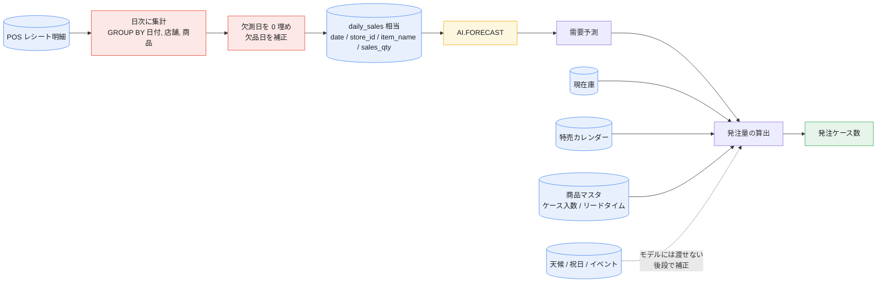

# 実データで使うための準備ガイド — 小売事業者が用意すべきデータ

[README](README.md) はサンプルデータで一通り動かすためのものです。
このドキュメントは、**サンプルを自社の実データに差し替えるときに何を用意すればよいか**を具体的にまとめたものです。

手順そのものは [README 8. 自分のデータに差し替える](README.md#8-自分のデータに差し替える)、
ここでは「その前段のデータ準備」を扱います。

- [0. 結論: 予測だけなら 1 テーブル・4 列](#0-結論-予測だけなら-1-テーブル4-列)
- [1. 【必須】日次売上実績](#1-必須日次売上実績)
- [2. 実データで必ずハマる 6 点](#2-実データで必ずハマる-6-点)
- [3. 【発注まで繋ぐなら】追加の 3 つ](#3-発注まで繋ぐなら追加の-3-つ)
- [4. 【渡せないが後段で効く】外部データ](#4-渡せないが後段で効く外部データ)
- [5. 現実的な始め方](#5-現実的な始め方)
- [6. 準備チェックリスト](#6-準備チェックリスト)

---

## 0. 結論: 予測だけなら 1 テーブル・4 列

`AI.FORECAST` が要求するのは **時間軸・実測値・系列キー** の 3 要素だけです。
特徴量エンジニアリングも、学習用データセットの分割も要りません。

| 用途 | 必要なテーブル | 本リポジトリの対応 | 必須度 |
| :--- | :--- | :--- | :--- |
| 需要予測そのもの | 日次売上実績 | `daily_sales` | **必須** |
| 発注量まで出す | 現在庫 | `current_inventory` | 発注するなら必須 |
| 特売の上振れ対応 | 特売カレンダー | `promotions` | 推奨 |
| 発注単位の丸め | 商品マスタ（ケース入数・リードタイム） | `CASE_LOT` 変数で代用 | 発注するなら必須 |



---

## 1. 【必須】日次売上実績

[`sql/01_seed_daily_sales.sql`](sql/01_seed_daily_sales.sql) が生成している `daily_sales` に相当するテーブルです。

| 列 | 型 | `AI.FORECAST` での役割 | 例 |
| :--- | :--- | :--- | :--- |
| `date` | `DATE` | `timestamp_col` — 時間軸 | `2026-08-23` |
| `store_id` | `STRING` | `id_cols` — 系列キー | `S01` |
| `item_name`（または JAN） | `STRING` | `id_cols` — 系列キー | `4901234567890` |
| `sales_qty` | `INT64` | `data_col` — **予測したい実測値** | `118` |

**「店舗 × 商品」の組み合わせ 1 つが 1 本の時系列**です。3 店舗 × 8 商品なら 24 系列を一度に予測します。

金額ではなく**数量**を入れてください。発注は個数で行うためと、金額だと値上げが需要トレンドとして混入してしまうためです。

> `daily_sales` には `store_name` 列もありますが、**モデルには渡していません**（表示用）。
> 実務でも `AI.FORECAST` に余計な列を渡す必要はありません
> （→ [README: モデルに渡しているのは「実績の数値」だけ](README.md#モデルに渡しているのは実績の数値だけ)）。

### 期間の目安

| | 点数 | 実務での意味 |
| :--- | :--- | :--- |
| API 下限 | 3 点 | 下回ると `ai_forecast_status` に `The time series data is too short.` が入る |
| 実用下限 | **90 日** | 週次周期を読ませるなら最低このくらいは欲しい |
| 推奨 | **365〜730 日** | 季節性・年末年始を含められる |
| API 上限 | 15,360 点（TimesFM 2.5） | 日次なら約 42 年。まず当たらない |

新商品や改装直後の店舗は履歴が足りず苦手です。類似商品の系列で代用するなどの運用が別途必要になります。

### POS からの作り方

レシート明細をそのまま渡すのではなく、**日次に集計してから**渡します。

```sql
SELECT
  DATE(d.sold_at, 'Asia/Tokyo') AS date,   -- タイムゾーンを明示する
  d.store_id,
  d.jan_code AS item_name,
  SUM(d.qty)  AS sales_qty                 -- 同一日の複数レシートを1点に畳む
FROM `pos.transaction_details` AS d
WHERE d.qty > 0                            -- 返品（マイナス行）を需要に混ぜるかは要判断
GROUP BY date, store_id, item_name
```

同一系列・同一日に 2 行以上あると 1 時点が重複します。`GROUP BY` は省略できません。

---

## 2. 実データで必ずハマる 6 点

**ここが実質的な作業量の大半です。** モデルのチューニングより、この前処理のほうが精度に効きます。

| # | 症状 | なぜ問題か | 対処 |
| :--- | :--- | :--- | :--- |
| 1 | **売れた日の行しかない** | 「売れなかった日」の行がないと、日次ではなく飛び飛びの系列と解釈される。平均水準も上振れする | カレンダーと `CROSS JOIN` して `IFNULL(qty, 0)` で 0 埋め |
| 2 | **欠品日の実績を需要として扱う** | 実際は 150 個売れたはずの日に在庫 80 個で完売 → 「80」を学習 → 予測が下がる → さらに発注が減る**過少発注スパイラル** | 在庫切れフラグを持ち、その日は前後から補間した値に置き換えてから投入する |
| 3 | **単位の混在** | バラ売り・ケース売り・g 売りが同じ SKU に混在すると系列が壊れる | 販売単位を統一するか、SKU を分ける |
| 4 | **商品コードの改廃** | リニューアルで JAN が変わると系列が途切れ、履歴ゼロの新商品扱いになる | 旧 JAN → 新 JAN の名寄せマスタを持ち、統合キーで集計する |
| 5 | **臨時休業・改装・棚替え** | 売上 0 の日を「需要 0」と学習してしまう | 休業日を除外するか、補間値で埋める |
| 6 | **タイムゾーン** | UTC のまま日付を切ると日本の 1 日とズレる | `DATE(sold_at, 'Asia/Tokyo')` のように明示する（本リポジトリの `TIMEZONE` 変数と同じ考え方） |

**特に 2 番目**が小売の需要予測で最も精度を落とす要因です。
「販売実績 ≠ 需要」であり、欠品した日のデータは**需要が頭打ちにされた状態**で記録されています。
これを放置すると、予測が下がる → 発注が減る → また欠品する、というループに入ります。

### 1. 欠測日の 0 埋め

```sql
WITH
  calendar AS (
    SELECT d AS date
    FROM UNNEST(GENERATE_DATE_ARRAY(
      DATE '2025-09-01', DATE '2026-08-23')) AS d
  ),
  series AS (   -- 実在する「店舗 × 商品」の組み合わせ
    SELECT DISTINCT store_id, item_name FROM `pos.daily_agg`
  )
SELECT
  c.date,
  s.store_id,
  s.item_name,
  IFNULL(a.sales_qty, 0) AS sales_qty
FROM calendar AS c
CROSS JOIN series AS s
LEFT JOIN `pos.daily_agg` AS a
  ON a.date = c.date AND a.store_id = s.store_id AND a.item_name = s.item_name
```

BigQuery には [`GAP_FILL`](https://cloud.google.com/bigquery/docs/working-with-time-series) テーブル関数もあり、
`NULL` / `LOCF`（直前値の繰り越し）/ `LINEAR`（線形補間）から埋め方を選べます。
**売上数量は「0 埋め」、欠品日の需要は「補間」**と、使い分けるのがポイントです。

### 2. 欠品日の補正

```sql
WITH flagged AS (
  SELECT
    date, store_id, item_name, sales_qty, is_stockout,
    -- 欠品日は NULL にしておく（AVG は NULL を無視するので平均が汚れない）
    IF(is_stockout, NULL, sales_qty) AS clean_qty
  FROM `pos.daily_agg_with_stockout_flag`
)
SELECT
  date, store_id, item_name,
  IF(
    is_stockout,
    -- 欠品日は実績を使わず、同一曜日の前後4回分（＝前後4週）の平均で置き換える
    CAST(ROUND(
      AVG(clean_qty) OVER (
        PARTITION BY store_id, item_name, EXTRACT(DAYOFWEEK FROM date)
        ORDER BY date
        ROWS BETWEEN 4 PRECEDING AND 4 FOLLOWING
      )
    ) AS INT64),
    sales_qty
  ) AS sales_qty
FROM flagged
```

`is_stockout` は在庫スナップショットから作ります（例: その日の期末在庫が 0 かつ販売あり）。
このフラグを持てるかどうかが、実運用での精度を大きく分けます。

---

## 3. 【発注まで繋ぐなら】追加の 3 つ

### 3-1. 現在庫

[`sql/02_seed_inventory_promotions.sql`](sql/02_seed_inventory_promotions.sql) の `current_inventory` に相当します。

| 列 | 例 |
| :--- | :--- |
| `store_id` | `S01` |
| `item_name` | `みんなの納豆` |
| `stock_qty` | `40` |

発注時点で店頭 + バックヤードにある数です。
[`sql/12_order_plan.sql`](sql/12_order_plan.sql) はこれを日付の古い順に引き当てます。
**日次スナップショットで持つ**のが実務的です（発注のたびに最新の 1 行を参照する）。

### 3-2. 特売カレンダー

| 列 | 例 |
| :--- | :--- |
| `store_id` | `S01` |
| `item_name` | `みんなの納豆` |
| `promo_date` | `2026-08-26` |
| `promo_name` | `納豆の日セール` |

前述のとおり `AI.FORECAST` には渡せません。予測が出た**後**に `LEFT JOIN` して、
「特売日は予測区間の上限値を採る」といった業務ルールで使います。

**過去の特売実績**（いつ・どの商品を・何割引で・何個売れたか）もあわせて持っておくと、
上振れ率を実測して掛けられるので精度が上がります。

### 3-3. 商品マスタ

本リポジトリは `CASE_LOT=10` の 1 変数で代用していますが、実務では商品ごとに必要です。

| 項目 | 例 | 用途 |
| :--- | :--- | :--- |
| ケース入数 | 10 個/ケース | 発注量の切り上げ |
| **発注リードタイム** | 2 日 | **予測の起点をずらす**（明日ではなく明後日以降の需要を見る） |
| 発注可能曜日 | 月・水・金 | 次回発注日までの需要を合算する必要がある |
| 最低陳列量 | 8 個 | 棚を空にしないための下限 |
| 賞味期限・日持ち | 3 日 | 何日先までまとめ買いしてよいかの上限 |

> **リードタイムは本リポジトリのデモには入っていません**（当日補充を前提にしています）。
> 実運用では「発注してから届くまでの日数」を考慮しないと発注計画になりません。
> `12_order_plan.sql` の `sales_date` に対してオフセットを入れる形で拡張します。

---

## 4. 【渡せないが後段で効く】外部データ

`AI.FORECAST` は単変量なので、これらは予測の**後**で補正に使います
（→ [README: 外部要因を効かせたいとき](README.md#外部要因特売天候祝日を効かせたいとき)）。

| データ | 効く商品の例 | 使い方 |
| :--- | :--- | :--- |
| 気温・天候 | アイス、鍋つゆ、飲料、傘 | 気温と売上の回帰を別に作り、予測値に係数を掛ける |
| 祝日・連休 | ほぼ全商品 | 不定期で過去実績からの学習が効きにくいため、カレンダーで別途補正 |
| 近隣イベント | 弁当、飲料、酒 | 花火大会・スタジアムの試合日などをカレンダー化 |
| 競合店のチラシ | 特売対象と同カテゴリ | 判明していれば下振れ側の補正に使う |

外部要因を**モデル内で**扱いたい場合は `ARIMA_PLUS_XREG` に切り替える選択肢があります
（ただし `CREATE MODEL` による学習が必要になり、ゼロショットの手軽さは失われます）。

---

## 5. 現実的な始め方

いきなり全 SKU でやらず、この順序を勧めます。

1. **1 カテゴリ × 全店 × 直近 1 年**で用意する
   例: 日配品 20 SKU × 30 店 = 600 系列 × 365 日
2. `make evaluate` 相当のバックテストを回し、**`mase < 1`**（＝「前日の値をそのままコピー」より賢い）を
   店舗別・商品別に確認する（→ [README 7. 精度を確認する](README.md#7-精度を確認するバックテスト)）
   このとき答え合わせ期間（`EVAL_HORIZON`）は **最低でも 4 週間**取ること。
   1 週間ぶんの数点で判定すると、指標がノイズで簡単に 1 をまたいで判断を誤ります
3. `mase > 1` の商品は、たいてい [§2 のデータ品質問題](#2-実データで必ずハマる-6-点)が原因。
   **予測モデルではなくデータを直す**
4. 精度が出た範囲だけ発注ロジックに乗せ、残りは人手のまま運用する

本リポジトリで試す場合は、`sql/10_forecast.sql` の `FROM` 句を自社テーブルに差し替え、
列名が違えば `data_col` / `timestamp_col` / `id_cols` を合わせるだけです。

```bash
make print-sql FILE=sql/10_forecast.sql            # 置換後の SQL を目視確認（BigQuery に接続しない）
make forecast DRY_RUN=1 PROJECT_ID=... DATASET=...  # 課金なしで構文とスキャン量だけ確認
```

---

## 6. 準備チェックリスト

実データを流す前に、この 12 項目を確認してください。

**日次売上実績**

- [ ] 「日付 × 店舗 × 商品」で 1 行に集計されている（レシート明細のままではない）
- [ ] 売上が 0 の日の行も存在する（欠測日が 0 埋めされている）
- [ ] 金額ではなく数量が入っている
- [ ] 日付が営業日基準のタイムゾーンで切られている
- [ ] 系列ごとに 90 日以上の履歴がある
- [ ] 商品コードの改廃が名寄せされている
- [ ] 販売単位が SKU 内で統一されている

**需要と実績のズレ**

- [ ] 欠品日が特定できる（在庫スナップショットまたは欠品フラグがある）
- [ ] 臨時休業・改装期間が除外または補間されている

**発注まで行う場合**

- [ ] 発注時点の在庫数が取得できる
- [ ] ケース入数・発注リードタイム・発注可能曜日がマスタ化されている
- [ ] 特売の予定と過去実績が日付単位で取得できる

---

## 参考リンク

- [README](README.md) — サンプルデータでの動かし方
- [`AI.FORECAST` 関数リファレンス](https://cloud.google.com/bigquery/docs/reference/standard-sql/bigqueryml-syntax-ai-forecast)
- [BigQuery で時系列データを扱う（`GAP_FILL` など）](https://cloud.google.com/bigquery/docs/working-with-time-series)
- [BigQuery ML の予測の概要](https://cloud.google.com/bigquery/docs/forecasting-overview)
