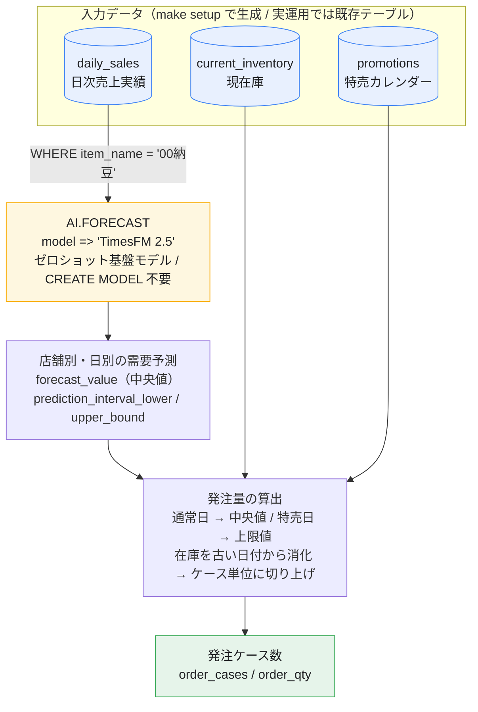
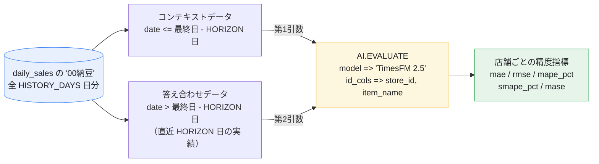
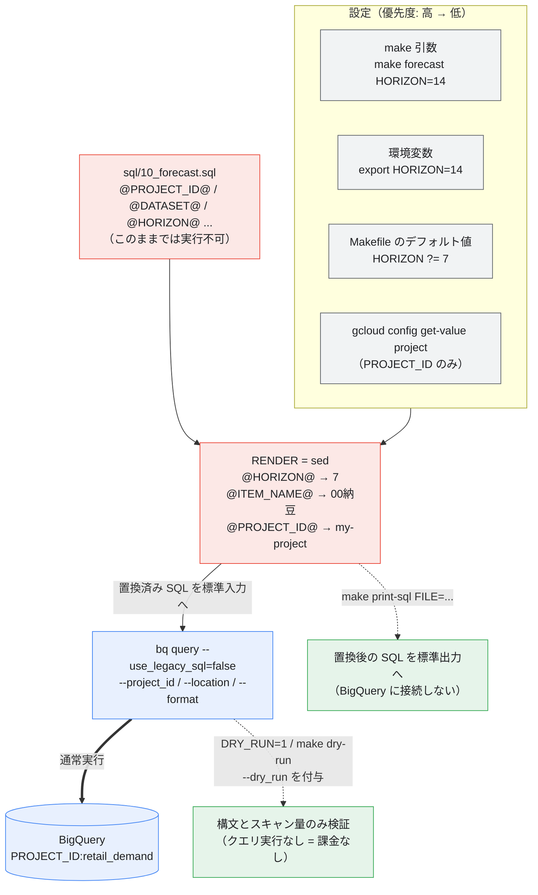
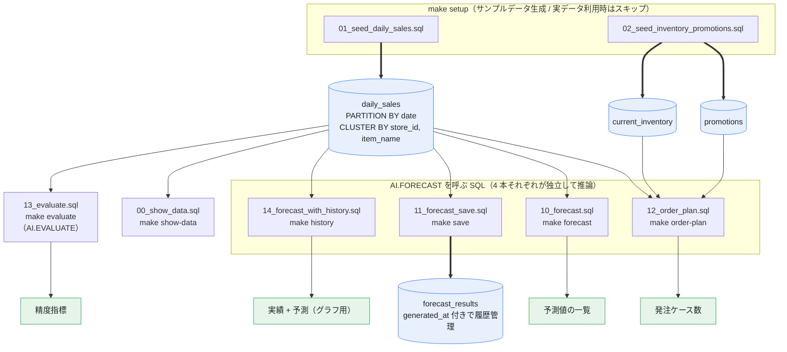

# bq-forecast-timesfm — 小売店の日次需要予測 (BigQuery ML `AI.FORECAST` / TimesFM)

スーパーマーケットなどの小売店で、**「00納豆」の仕入れ量（発注量）を決めるために店舗ごとの日次需要を予測する**サンプルです。

納豆は賞味期限が短く、欠品も廃棄ロスも避けたい商材のため、精度の高い日次予測が効いてきます。

BigQuery ML の `AI.FORECAST` は **TimesFM というゼロショットの時系列基盤モデル**を使うため、
`CREATE MODEL` による学習が不要です。SQL を1本書くだけで予測が返ってきます。



---

## 1. 前提条件

| 必要なもの | 備考 |
| :--- | :--- |
| Google Cloud プロジェクト | 課金有効化済みであること |
| `gcloud` / `bq` CLI | [インストール手順](https://cloud.google.com/sdk/docs/install) |
| BigQuery API | `make enable-apis` で有効化できます |
| IAM 権限 | `roles/bigquery.user` + `roles/bigquery.dataEditor` 相当 |
| `make`, `sed` | 標準的な Linux / macOS なら導入済み |

`AI.FORECAST` と TimesFM は [BigQuery ML がサポートするすべてのロケーション](https://cloud.google.com/bigquery/docs/locations#locations-for-non-remote-models)で利用できます。

---

## 2. セットアップ手順

### 2-1. 認証

```bash
gcloud auth login
gcloud auth application-default login
gcloud config set project <YOUR_PROJECT_ID>
```

### 2-2. API を有効化

```bash
make enable-apis
```

### 2-3. 前提条件をチェック

```bash
make check     # CLI の有無 / 認証 / PROJECT_ID を確認
make config    # 現在の設定値を表示
```

> **注意:** シェルに `PROJECT_ID` 環境変数が設定されている場合、Makefile の `?=` によって
> そちらが優先されます（`gcloud config` の値より強い）。
> 意図しないプロジェクトを指していないか `make config` で必ず確認してください。

### 2-4. データセットとサンプルデータを作成

```bash
make setup
```

`make setup` は次の3つをまとめて実行します。

1. `dataset` — データセット `retail_demand` を作成
2. `seed` — サンプルテーブルを3つ作成
3. `show-data` — 投入結果を表示

| テーブル | 内容 |
| :--- | :--- |
| `daily_sales` | 3店舗 × 3商品 × 180日分の日次売上実績。土日に伸びる週次周期性と緩やかな増加トレンド入り |
| `current_inventory` | 各店舗の現在庫（発注量から差し引く） |
| `promotions` | 特売カレンダー（欠品を避けたい日） |

`daily_sales` には「00納豆」以外に「絹ごし豆腐」「成分無調整牛乳」も入っています。
**実運用と同じく、対象商品を `WHERE` で絞り込んでから予測する**流れを再現するためです。

| date | store_id | store_name | item_name | sales_qty |
| :--- | :--- | :--- | :--- | :--- |
| 2026-08-01 | S01 | 新宿店 | 00納豆 | 120 |
| 2026-08-01 | S02 | 渋谷店 | 00納豆 | 85 |
| 2026-08-02 | S01 | 新宿店 | 00納豆 | 115 |
| ... | ... | ... | ... | ... |

### 2-5. 予測を実行

```bash
make forecast
```

---

## 3. make コマンド一覧

```bash
make help      # 一覧を表示
```

| コマンド | 説明 |
| :--- | :--- |
| `make help` | ターゲット一覧を表示（デフォルト） |
| `make config` | 現在の設定値を表示 |
| `make check` | CLI / 認証 / `PROJECT_ID` を確認 |
| `make enable-apis` | BigQuery 関連 API を有効化 |
| `make dataset` | データセットを作成（既存ならスキップ） |
| `make seed` | サンプルデータを投入 |
| `make setup` | `dataset` + `seed` + `show-data` |
| `make show-data` | 投入した売上実績の内訳を表示 |
| **`make forecast`** | **【本題】店舗別の需要予測を実行** |
| **`make order-plan`** | **予測値から発注ケース数を算出** |
| `make evaluate` | バックテストで精度（MAPE 等）を確認 |
| `make history` | 実績 + 予測をまとめて出力（グラフ用） |
| `make save` | 予測結果を `forecast_results` テーブルに保存 |
| `make demo` | `setup` → `forecast` → `order-plan` を一気に実行 |
| `make dry-run` | 全 SQL の構文チェック（**課金なし**） |
| `make print-sql` | 置換後の SQL を表示（`FILE=sql/10_forecast.sql`） |
| `make clean` | データセットをテーブルごと削除（確認あり） |

### 設定の上書き

すべての設定は環境変数または `make` 引数で上書きできます。

```bash
make forecast HORIZON=14                  # 14日先まで予測
make forecast ITEM_NAME=絹ごし豆腐          # 別の商品を予測
make forecast CONFIDENCE_LEVEL=0.8        # 予測区間を狭める
make forecast MODEL="TimesFM 2.0"         # 旧モデルと比較
make forecast FORMAT=csv > forecast.csv   # CSV で出力
make forecast DRY_RUN=1                   # 実行せず構文チェックのみ
make order-plan CASE_LOT=20               # 発注ロットを20個/ケースに
make setup HISTORY_DAYS=365               # 1年分のサンプルデータを生成
```

| 変数 | デフォルト | 説明 |
| :--- | :--- | :--- |
| `PROJECT_ID` | `gcloud config` の値 | GCP プロジェクト ID |
| `DATASET` | `retail_demand` | データセット名 |
| `LOCATION` | `asia-northeast1` | BigQuery ロケーション |
| `TIMEZONE` | `Asia/Tokyo` | サンプルデータ生成の基準タイムゾーン |
| `ITEM_NAME` | `00納豆` | 予測対象の商品名 |
| `MODEL` | `TimesFM 2.5` | `TimesFM 2.5` または `TimesFM 2.0` |
| `HORIZON` | `7` | 何日先まで予測するか（有効範囲 `[1, 10000]`） |
| `CONFIDENCE_LEVEL` | `0.95` | 予測区間の信頼度（有効範囲 `[0, 1)`） |
| `HISTORY_DAYS` | `180` | サンプルデータの過去日数 |
| `CASE_LOT` | `10` | 発注ケース入数（個/ケース） |
| `FORMAT` | `pretty` | `pretty` / `csv` / `json` / `prettyjson` |
| `DRY_RUN` | (空) | `1` で構文チェックのみ |

---

## 4. 予測を実行する SQL

`AI.FORECAST` はテーブル全体だけでなく、**カッコ `()` で囲んだサブクエリを直接入力データとして渡せます**。
これにより、中間テーブルを作らずに「00納豆」だけに絞って予測できます。

[`sql/10_forecast.sql`](sql/10_forecast.sql) の中核部分:

```sql
SELECT *
FROM AI.FORECAST(
  -- 1. 入力データ: '00納豆' の過去データのみを抽出して渡す
  (
    SELECT date, store_id, item_name, sales_qty
    FROM `project.retail_demand.daily_sales`
    WHERE item_name = '00納豆'
  ),
  model            => 'TimesFM 2.5',            -- 推奨される最新のゼロショットモデル
  data_col         => 'sales_qty',              -- 予測したい数値（売上数）
  timestamp_col    => 'date',                   -- 時間軸（日付）
  id_cols          => ['store_id', 'item_name'],-- 店舗と商品をセットで1つの時系列として認識させる
  horizon          => 7,                        -- 未来7日分を予測
  confidence_level => 0.95                      -- 予測区間の信頼度
);
```

`item_name` は「00納豆」で固定されていますが、出力結果をわかりやすくするため `id_cols` に含めておくと便利です。

### 引数

| 引数 | 必須 | 説明 |
| :--- | :--- | :--- |
| 第1引数 | ✓ | `TABLE \`p.d.t\`` またはカッコで囲んだサブクエリ |
| `data_col` | ✓ | 予測対象の数値列。`INT64` / `NUMERIC` / `BIGNUMERIC` / `FLOAT64` |
| `timestamp_col` | ✓ | 時間軸の列。`TIMESTAMP` / `DATE` / `DATETIME` |
| `model` | | `TimesFM 2.5`（デフォルト・推奨）または `TimesFM 2.0` |
| `id_cols` | | 時系列を識別する列。`STRING` / `INT64` / `ARRAY<STRING>` / `ARRAY<INT64>` |
| `horizon` | | 予測する時点数。デフォルト `10`、範囲 `[1, 10000]` |
| `forecast_end_timestamp` | | 終了時刻で指定する場合。`horizon` とは併用不可 |
| `confidence_level` | | 予測区間の信頼度。デフォルト `0.95`、範囲 `[0, 1)` |
| `output_historical_time_series` | | `TRUE` で入力データも併せて返す。デフォルト `FALSE` |
| `context_window` | | 参照する直近データ点数。未指定なら自動選択 |

---

## 5. 出力される結果

```bash
make forecast
```

実際の出力（`HISTORY_DAYS=180`, `HORIZON=7` での実行例、抜粋）:

| store_id | item_name | sales_date | dow | forecast_qty | lower_bound | upper_bound |
| :--- | :--- | :--- | :--- | :--- | :--- | :--- |
| S01 | 00納豆 | 2026-08-24 | Mon | **123.0** | 108.4 | 139.7 |
| S01 | 00納豆 | 2026-08-25 | Tue | **124.8** | 109.8 | 140.3 |
| S01 | 00納豆 | 2026-08-28 | Fri | **123.5** | 108.3 | 136.9 |
| S01 | 00納豆 | 2026-08-29 | Sat | **147.6** | 130.9 | 163.2 |
| S01 | 00納豆 | 2026-08-30 | Sun | **147.5** | 129.9 | 163.5 |
| S02 | 00納豆 | 2026-08-24 | Mon | **89.4** | 77.8 | 103.4 |
| S03 | 00納豆 | 2026-08-24 | Mon | **106.6** | 93.3 | 121.0 |

土日（Sat / Sun）の予測値が平日より約 20% 高くなっており、**サンプルデータに仕込んだ週次周期性を
TimesFM が学習なしで拾えている**ことがわかります。

> 予測は「入力データの最終日の翌日」から始まります。サンプルデータは昨日までなので、
> `sales_date` は本日から `HORIZON` 日分になります。

`AI.FORECAST` が返す生の列は次のとおりです（`sql/10_forecast.sql` では見やすいように別名を付けています）。

| 列 | 説明 |
| :--- | :--- |
| `id_cols` に指定した列 | 入力で指定した識別列がそのまま返る |
| `forecast_timestamp` | 予測対象の時点（`TIMESTAMP`） |
| `forecast_value` | 予測値。モデル出力の **50%分位点（中央値）** |
| `confidence_level` | 入力した信頼度。全行同じ値 |
| `prediction_interval_lower_bound` | 予測区間の下限 |
| `prediction_interval_upper_bound` | 予測区間の上限 |
| `ai_forecast_status` | 成功時は空文字。失敗時はエラー文字列 |

> **`output_historical_time_series => TRUE` にすると列名が変わります。**
> `forecast_timestamp` / `forecast_value` の代わりに
> `time_series_type`（`history` or `forecast`）/ `time_series_timestamp` / `time_series_data` が返ります。
> `make history` がこのモードを使っています。

---

## 6. 仕入れ（発注）業務での使い方

```bash
make order-plan
```

[`sql/12_order_plan.sql`](sql/12_order_plan.sql) は、予測値を実際の発注ケース数に変換します。

1. **通常日** — `forecast_value`（予測の中央値）を必要数量とする
   例: 新宿店（S01）の 8/25 は約 123 個売れると予測 → 現在の在庫を差し引いて発注量を決める
2. **特売日** — `prediction_interval_upper_bound`（予測の上限値）を必要数量とする
   ブレの範囲の最大値まで見て少し多めに発注し、**品切れによる機会損失を防ぐ**
3. **在庫の消化** — 現在庫を日付の古い順に引き当て、足りない分だけを発注する
4. **ロット丸め** — ケース入数（`CASE_LOT`、デフォルト10個）に切り上げる

実際の出力（S01 新宿店、現在庫 40 個・`CASE_LOT=10` の場合）:

| store_id | sales_date | dow | promo | forecast_qty | upper_bound | needed_qty | stock_available | order_cases | order_qty |
| :--- | :--- | :--- | :--- | :--- | :--- | :--- | :--- | :--- | :--- |
| S01 | 2026-08-24 | Mon | - | 123.0 | 139.7 | 123.0 | **40.0** | 9 | 90 |
| S01 | 2026-08-25 | Tue | - | 124.8 | 140.3 | 124.8 | 0.0 | 13 | 130 |
| S01 | 2026-08-26 | Wed | 納豆の日セール | 122.8 | 136.7 | **136.7** | 0.0 | 14 | 140 |
| S01 | 2026-08-28 | Fri | - | 123.5 | 136.9 | 123.5 | 0.0 | 13 | 130 |
| S01 | 2026-08-29 | Sat | - | 147.6 | 163.2 | 147.6 | 0.0 | 15 | 150 |

- 初日（8/24）は現在庫 40 個が引き当てられ、`123.0 - 40 = 83` → 切り上げて **9 ケース（90 個）**
- 特売日（8/26）だけ `needed_qty` が `upper_bound` の 136.7 になり、通常日より多めに発注される
- 土曜（8/29）は週次周期性を反映して 15 ケースに増える

納豆は賞味期限が短いため、**上限値の採用は特売日に限定**し、通常日は中央値ベースにして廃棄ロスを抑えています。
このバランスは `sql/12_order_plan.sql` の `needed_qty` の定義を書き換えて調整できます。

---

## 7. 精度を確認する（バックテスト）

発注ロジックに乗せる前に、どれくらいの誤差が出るかを把握しておきます。

```bash
make evaluate
```

直近 `HORIZON` 日を答え合わせ用に取り置き、それ以前のデータだけで予測して実績と突き合わせます
（[`AI.EVALUATE`](https://cloud.google.com/bigquery/docs/reference/standard-sql/bigqueryml-syntax-ai-evaluate)）。



| 指標 | 見方 |
| :--- | :--- |
| `mae` | 平均絶対誤差。「平均して何個ズレるか」。発注単位と直接比較できる |
| `rmse` | 二乗平均平方根誤差。大きな外し方を強くペナルティ |
| `mape_pct` | 平均絶対パーセント誤差（%）。小さいほど高精度 |
| `smape_pct` | 対称版 MAPE。実績が小さい日の影響を受けにくい |
| `mase` | **1未満なら「前日の値をそのまま使う」より優秀** |

実際の出力（サンプルデータでの実行例）:

| store_id | mae | rmse | mape_pct | smape_pct | mase |
| :--- | :--- | :--- | :--- | :--- | :--- |
| S01 | 7.52 | 8.43 | 5.76 | 5.73 | 0.993 |
| S02 | 5.01 | 6.02 | 4.88 | 5.04 | 0.887 |
| S03 | 2.97 | 4.34 | 2.56 | 2.62 | 0.412 |

MAPE 2.6〜5.8%、`mase` は全店舗で 1 未満です。
ただしこれは**周期性が素直なサンプルデータでの数値**なので、実データではこれより悪化します。
`make evaluate` を実データで回して、発注に使える精度かどうかを店舗ごとに確認してください。

---

## 8. 自分のデータに差し替える

サンプルデータをやめて実データを使う場合は、`sql/*.sql` の参照先を書き換えるだけです。

1. `make dataset` / `make seed` は実行しない
2. `sql/10_forecast.sql` などの
   `` FROM `@PROJECT_ID@.@DATASET@.daily_sales` `` を実テーブルに変更
3. 列名が違う場合は `data_col` / `timestamp_col` / `id_cols` を実列名に合わせる
4. `make forecast PROJECT_ID=<実プロジェクト> DATASET=<実データセット>`

`make print-sql FILE=sql/10_forecast.sql` で置換後の SQL を確認してから実行すると安全です。

### データ量に関する制約

| 項目 | 制約 |
| :--- | :--- |
| 最小データ点数 | **3点**。下回ると `ai_forecast_status` に `The time series data is too short.` が入る |
| 最大データ点数 | TimesFM 2.5 は **15,360点**、TimesFM 2.0 は **2,048点**。超過分は古い側から無視される |
| `context_window` | 未指定なら入力点数をカバーする最小の値が自動選択される（64 / 128 / 256 / 512 / 1024 / 2048 / 4096 / 8192 / 15360） |

日次データなら 15,360 点は約42年分なので、通常の小売データで上限に当たることはまずありません。
一方で **時系列ごとに最低でも数ヶ月分の履歴があると週次周期性を拾いやすくなります**（新商品は苦手）。

---

## 9. コストと後始末

`AI.FORECAST` / `AI.EVALUATE` は BigQuery ML の
[evaluation, inspection, and prediction レート](https://cloud.google.com/bigquery/pricing#bigquery-ml-pricing)で課金されます。
このサンプルのデータ量（3時系列 × 180日）であればごくわずかです。

実行前に課金なしで構文とスキャン量を確認できます。

```bash
make dry-run              # 全 SQL をまとめてチェック
make forecast DRY_RUN=1   # 個別にチェック
```

後始末:

```bash
make clean            # 確認プロンプトあり
make clean FORCE=1    # 確認なしで削除
```

---

## 10. ファイル構成と実行の仕組み

```
bq-forecast-timesfm/
├── Makefile
├── README.md
└── sql/
    ├── 00_show_data.sql                 投入データの確認
    ├── 01_seed_daily_sales.sql          サンプル売上実績を生成
    ├── 02_seed_inventory_promotions.sql 在庫マスタ / 特売カレンダーを生成
    ├── 10_forecast.sql                  ★ AI.FORECAST による需要予測
    ├── 11_forecast_save.sql             予測結果をテーブルに保存
    ├── 12_order_plan.sql                ★ 予測値 → 発注ケース数
    ├── 13_evaluate.sql                  AI.EVALUATE によるバックテスト
    └── 14_forecast_with_history.sql     実績 + 予測（グラフ用）
```

### 10-1. 実行パイプライン（プレースホルダの置換）

`sql/*.sql` は `@PROJECT_ID@` のようなプレースホルダを含むため、**単体では実行できません**。
`make` が `sed` で設定値に置換し、その結果を標準入力から `bq query` に流し込みます。



> 設定を増やすときは、**Makefile の変数定義と `RENDER` の `-e` 行の両方**を更新してください。

### 10-2. SQL とテーブルの依存関係

どの SQL がどのテーブルを読み書きするか、対応する `make` ターゲットとあわせて示します。



TimesFM はゼロショットのため学習済みモデルという成果物が残りません。
そのため `AI.FORECAST` の呼び出しは上記 4 本の SQL に**それぞれ独立して書かれており**、
予測パラメータのロジックを変える場合は 4 箇所すべてを修正する必要があります
（各 SQL を単体で読んで理解できるようにするための、意図的な重複です）。

---

## 参考リンク

- [`AI.FORECAST` 関数リファレンス](https://cloud.google.com/bigquery/docs/reference/standard-sql/bigqueryml-syntax-ai-forecast)
- [`AI.EVALUATE` 関数リファレンス](https://cloud.google.com/bigquery/docs/reference/standard-sql/bigqueryml-syntax-ai-evaluate)
- [TimesFM モデルで複数の時系列を予測するチュートリアル](https://cloud.google.com/bigquery/docs/timesfm-time-series-forecasting-tutorial)
- [BigQuery ML の予測の概要](https://cloud.google.com/bigquery/docs/forecasting-overview)
