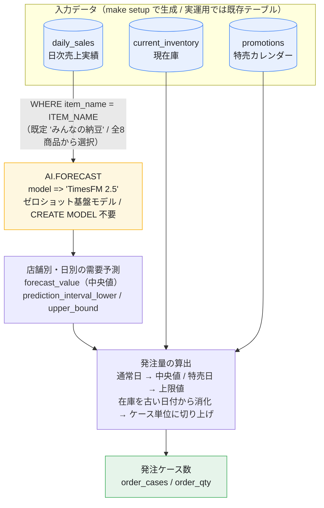
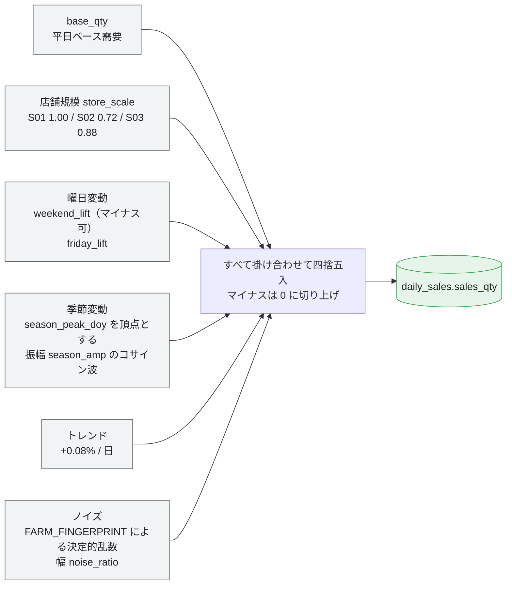
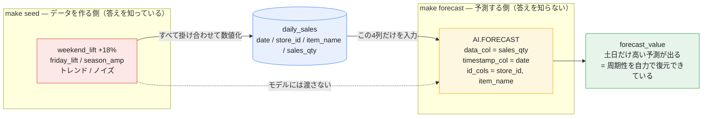
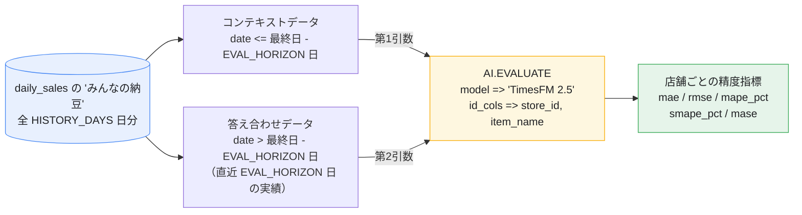
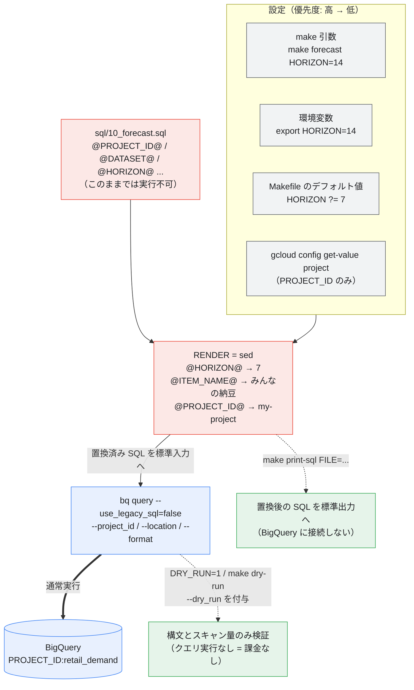
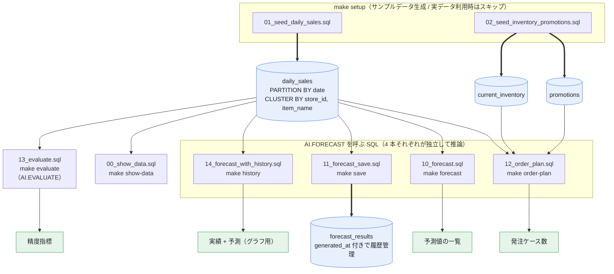

# bq-forecast-timesfm — 小売店の日次需要予測 (BigQuery ML `AI.FORECAST` / TimesFM)

スーパーマーケットなどの小売店で、**「みんなの納豆」の仕入れ量（発注量）を決めるために店舗ごとの日次需要を予測する**サンプルです。

納豆は賞味期限が短く、欠品も廃棄ロスも避けたい商材のため、精度の高い日次予測が効いてきます。

BigQuery ML の `AI.FORECAST` は **TimesFM というゼロショットの時系列基盤モデル**を使うため、
`CREATE MODEL` による学習が不要です。SQL を1本書くだけで予測が返ってきます。

サンプルデータには**需要の型が異なる8商品**（夏物 / 冬物 / 平日型 / ほぼフラット）を収録しています。
`ITEM_NAME` を差し替えるだけで、**どんな需要パターンなら TimesFM がうまく当てられるのか**を比較できます
（→ [2-4-1. 収録している商品](#2-4-1-収録している商品)）。

> **実データで使う予定の方へ:** 自社の POS データに差し替えるとき何を用意すればよいかは
> **[GETTING_STARTED.md — 小売事業者が用意すべきデータ](GETTING_STARTED.md)** にまとめています。
> 必須は「日次売上実績」1 テーブルだけですが、欠品日の扱いなど前処理で必ずハマる点があります。



---

## 1. 前提条件

| 必要なもの | 備考 |
| :--- | :--- |
| Google Cloud プロジェクト | 課金有効化済みであること |
| `gcloud` / `bq` CLI | [インストール手順](https://cloud.google.com/sdk/docs/install) |
| BigQuery API | `make enable-apis` で有効化できます |
| IAM 権限 | `roles/bigquery.user` + `roles/bigquery.dataEditor` 相当 |
| `make`, `sed` | 標準的な Linux / macOS なら導入済み |

`AI.FORECAST` と TimesFM は [BigQuery ML がサポートするすべてのロケーション](https://cloud.google.com/bigquery/docs/locations#locations-for-non-remote-models)で利用できます。

---

## 2. セットアップ手順

### 2-1. 認証

```bash
gcloud auth login
gcloud auth application-default login
gcloud config set project <YOUR_PROJECT_ID>
```

### 2-2. API を有効化

```bash
make enable-apis
```

### 2-3. 前提条件をチェック

```bash
make check     # CLI の有無 / 認証 / PROJECT_ID を確認
make config    # 現在の設定値を表示
```

> **注意:** シェルに `PROJECT_ID` 環境変数が設定されている場合、Makefile の `?=` によって
> そちらが優先されます（`gcloud config` の値より強い）。
> 意図しないプロジェクトを指していないか `make config` で必ず確認してください。

### 2-4. データセットとサンプルデータを作成

```bash
make setup
```

`make setup` は次の3つをまとめて実行します。

1. `dataset` — データセット `retail_demand` を作成
2. `seed` — サンプルテーブルを3つ作成
3. `show-data` — 投入結果を表示

| テーブル | 内容 |
| :--- | :--- |
| `daily_sales` | 3店舗 × 8商品 × 180日分の日次売上実績。商品ごとに異なる曜日変動・季節変動と、緩やかな増加トレンド入り |
| `current_inventory` | 各店舗の現在庫（発注量から差し引く）。8商品ぶん用意 |
| `promotions` | 特売カレンダー（欠品を避けたい日） |

| date | store_id | store_name | item_name | sales_qty |
| :--- | :--- | :--- | :--- | :--- |
| 2026-08-03 | S01 | 新宿店 | みんなの納豆 | 134 |
| 2026-08-03 | S02 | 渋谷店 | みんなの納豆 | 88 |
| 2026-08-04 | S01 | 新宿店 | みんなの納豆 | 118 |
| ... | ... | ... | ... | ... |

### 2-4-1. 収録している商品

`daily_sales` には「みんなの納豆」以外の商品も入っています。
**実運用と同じく、対象商品を `WHERE` で絞り込んでから予測する**流れを再現するためと、
**需要の型が違う商品で予測精度がどう変わるかを比べられる**ようにするためです。

`ITEM_NAME` を差し替えるだけで、どの商品でも `forecast` / `order-plan` / `evaluate` が動きます。

| 商品名 | 需要の型 | 曜日変動（平日→土日） | 季節変動（年間ピーク/底） |
| :--- | :--- | :--- | :--- |
| `みんなの納豆` | **予測対象の主役**。週次周期性のみ | +18% | なし（意図的に無効化） |
| `アイスクリーム` | 夏物。季節変動が最も大きい | +25% | 7月 / 1月・**約3.6倍** |
| `鍋つゆ` | 冬物。アイスとほぼ逆位相で夏場は動かない | +27% | 2月 / 7月・**約4.8倍** |
| `缶ビール350ml` | 季節性 + 強い曜日性の複合。金曜も跳ねる | +31%（金曜も +22%） | 8月 / 1月・約2.2倍 |
| `おにぎり` | **平日型**。オフィス需要で土日に落ちる | **−25%** | ほぼなし |
| `食パン` | ベースライン。曜日差・季節差・ノイズすべて小さい | +3% | ほぼなし |
| `絹ごし豆腐` | 夏の冷奴需要でゆるやかに伸びる | +11% | 7月 / 1月・約1.5倍 |
| `成分無調整牛乳` | 日配の定番。変動は小さめ | +6% | ほぼなし |

上の数値は S01（新宿店）で `HISTORY_DAYS=365` として生成し、実測した平均値です。
季節変動の倍率には**緩やかな増加トレンド（+0.08%/日、1年で約 +29%）が乗っている**ため、
商品マスタに設定した振幅そのものとは少しズレます。

日次の売上数は [`sql/01_seed_daily_sales.sql`](sql/01_seed_daily_sales.sql) の `items` CTE のパラメータから、
次の掛け算で組み立てています。



ノイズは日付・店舗・商品名のハッシュから作るので、**何度実行しても同じ値**になります。

> **ここの掛け算は `make seed` でデータを「作る」ときだけの話です。**
> `daily_sales` に残るのは掛け算の結果（`sales_qty` の数値）だけで、`weekend_lift` などのパラメータは列として保存されません。
> `make forecast` はこの数値の並びしか見ないので、**曜日変動はモデルにとって「与えられた答え」ではなく「実績から読み取るべきパターン」**です
> （→ [モデルに渡しているのは「実績の数値」だけ](#モデルに渡しているのは実績の数値だけ)）。

```bash
make forecast ITEM_NAME=おにぎり     # 土日に落ちる型を予測できるか
make forecast ITEM_NAME=缶ビール350ml # 金土日の3段の山を拾えるか
make evaluate ITEM_NAME=食パン        # 素直な商品での精度の上限を見る
make evaluate ITEM_NAME=鍋つゆ        # ノイズと季節変動が大きい商品と比較する
```

> **季節変動と予測期間の関係:** デフォルトの `HORIZON=7` では、7日間で年間の季節変動はほとんど進まないため、
> 季節性は「水準・トレンド」としてしか効きません。季節の山谷そのものを見たい場合は
> `make setup HISTORY_DAYS=365` で1年分を生成し、`make history` でグラフ化してください。

### 2-5. 予測を実行

```bash
make forecast
```

---

## 3. make コマンド一覧

```bash
make help      # 一覧を表示
```

| コマンド | 説明 |
| :--- | :--- |
| `make help` | ターゲット一覧を表示（デフォルト） |
| `make config` | 現在の設定値を表示 |
| `make check` | CLI / 認証 / `PROJECT_ID` を確認 |
| `make enable-apis` | BigQuery 関連 API を有効化 |
| `make dataset` | データセットを作成（既存ならスキップ） |
| `make seed` | サンプルデータを投入 |
| `make setup` | `dataset` + `seed` + `show-data` |
| `make show-data` | 投入した売上実績の内訳を表示 |
| **`make forecast`** | **【本題】店舗別の需要予測を実行** |
| **`make order-plan`** | **予測値から発注ケース数を算出** |
| `make evaluate` | バックテスト（直近 `EVAL_HORIZON` 日）で精度（MAPE 等）を確認 |
| `make history` | 実績 + 予測をまとめて出力（グラフ用） |
| `make save` | 予測結果を `forecast_results` テーブルに保存 |
| `make demo` | `setup` → `forecast` → `order-plan` を一気に実行 |
| `make dry-run` | 全 SQL の構文チェック（**課金なし**） |
| `make print-sql` | 置換後の SQL を表示（`FILE=sql/10_forecast.sql`） |
| `make clean` | データセットをテーブルごと削除（確認あり） |

### 設定の上書き

すべての設定は環境変数または `make` 引数で上書きできます。

```bash
make forecast HORIZON=14                  # 14日先まで予測
make forecast ITEM_NAME=絹ごし豆腐          # 別の商品を予測
make forecast CONFIDENCE_LEVEL=0.8        # 予測区間を狭める
make forecast MODEL="TimesFM 2.0"         # 旧モデルと比較
make forecast FORMAT=csv > forecast.csv   # CSV で出力
make forecast DRY_RUN=1                   # 実行せず構文チェックのみ
make order-plan CASE_LOT=20               # 発注ロットを20個/ケースに
make setup HISTORY_DAYS=365               # 1年分のサンプルデータを生成
make evaluate EVAL_HORIZON=56             # 答え合わせ期間を8週間に広げる
```

| 変数 | デフォルト | 説明 |
| :--- | :--- | :--- |
| `PROJECT_ID` | `gcloud config` の値 | GCP プロジェクト ID |
| `DATASET` | `retail_demand` | データセット名 |
| `LOCATION` | `asia-northeast1` | BigQuery ロケーション |
| `TIMEZONE` | `Asia/Tokyo` | サンプルデータ生成の基準タイムゾーン |
| `ITEM_NAME` | `みんなの納豆` | 予測対象の商品名 |
| `MODEL` | `TimesFM 2.5` | `TimesFM 2.5` または `TimesFM 2.0` |
| `HORIZON` | `7` | 何日先まで予測するか（有効範囲 `[1, 10000]`） |
| `EVAL_HORIZON` | `28` | `make evaluate` で答え合わせに使う日数（`HORIZON` とは独立） |
| `CONFIDENCE_LEVEL` | `0.95` | 予測区間の信頼度（有効範囲 `[0, 1)`） |
| `HISTORY_DAYS` | `180` | サンプルデータの過去日数 |
| `CASE_LOT` | `10` | 発注ケース入数（個/ケース） |
| `FORMAT` | `pretty` | `pretty` / `csv` / `json` / `prettyjson` |
| `DRY_RUN` | (空) | `1` で構文チェックのみ |

---

## 4. 予測を実行する SQL

`AI.FORECAST` はテーブル全体だけでなく、**カッコ `()` で囲んだサブクエリを直接入力データとして渡せます**。
これにより、中間テーブルを作らずに「みんなの納豆」だけに絞って予測できます。

[`sql/10_forecast.sql`](sql/10_forecast.sql) の中核部分:

```sql
SELECT *
FROM AI.FORECAST(
  -- 1. 入力データ: 'みんなの納豆' の過去データのみを抽出して渡す
  (
    SELECT date, store_id, item_name, sales_qty
    FROM `project.retail_demand.daily_sales`
    WHERE item_name = 'みんなの納豆'
  ),
  model            => 'TimesFM 2.5',            -- 推奨される最新のゼロショットモデル
  data_col         => 'sales_qty',              -- 予測したい数値（売上数）
  timestamp_col    => 'date',                   -- 時間軸（日付）
  id_cols          => ['store_id', 'item_name'],-- 店舗と商品をセットで1つの時系列として認識させる
  horizon          => 7,                        -- 未来7日分を予測
  confidence_level => 0.95                      -- 予測区間の信頼度
);
```

`item_name` は「みんなの納豆」で固定されていますが、出力結果をわかりやすくするため `id_cols` に含めておくと便利です。

### モデルに渡しているのは「実績の数値」だけ

**曜日も季節も特売も、モデルには一切教えていません。**
`AI.FORECAST` に渡しているのは上の 4 列（`date` / `store_id` / `item_name` / `sales_qty`）だけです。

| 渡しているもの | 渡していないもの |
| :--- | :--- |
| `date` — 時間軸 | 曜日フラグ（土日 / 金曜） |
| `sales_qty` — 実績の売上数そのもの | 季節・気温・祝日などのカレンダー情報 |
| `store_id` / `item_name` — 系列を分けるための識別子 | 特売の予定（`promotions` テーブル） |
| | サンプルデータ生成時のパラメータ（`weekend_lift` 等） |

`id_cols` は「どこまでを 1 本の時系列として扱うか」を決めるためのキーであって、予測の手がかりとなる特徴量ではありません。
そもそも `AI.FORECAST` は**外生変数（covariate / regressor）を受け取る引数を持たない単変量 API** です（→ [引数の一覧](#引数)）。

つまり TimesFM は、`sales_qty` の並び方そのものから「7 日ごとにこの位置が跳ねる」というパターンを
**暗黙に読み取って**予測しています。「土曜だから 1.18 倍」という正解を与えているわけではありません。



このデモが見ているのは「seed に仕込んだ需要の型を、TimesFM が実績値だけから復元できるか」です。
答え合わせ用の正解（曜日係数）をモデルに漏らしていないからこそ、
[5. 出力される結果](#5-出力される結果)の土日の跳ね上がりに意味があります。

### 引数

| 引数 | 必須 | 説明 |
| :--- | :--- | :--- |
| 第1引数 | ✓ | `TABLE \`p.d.t\`` またはカッコで囲んだサブクエリ |
| `data_col` | ✓ | 予測対象の数値列。`INT64` / `NUMERIC` / `BIGNUMERIC` / `FLOAT64` |
| `timestamp_col` | ✓ | 時間軸の列。`TIMESTAMP` / `DATE` / `DATETIME` |
| `model` | | `TimesFM 2.5`（デフォルト・推奨）または `TimesFM 2.0` |
| `id_cols` | | 時系列を識別する列。`STRING` / `INT64` / `ARRAY<STRING>` / `ARRAY<INT64>` |
| `horizon` | | 予測する時点数。デフォルト `10`、範囲 `[1, 10000]` |
| `forecast_end_timestamp` | | 終了時刻で指定する場合。`horizon` とは併用不可 |
| `confidence_level` | | 予測区間の信頼度。デフォルト `0.95`、範囲 `[0, 1)` |
| `output_historical_time_series` | | `TRUE` で入力データも併せて返す。デフォルト `FALSE` |
| `context_window` | | 参照する直近データ点数。未指定なら自動選択 |

---

## 5. 出力される結果

```bash
make forecast
```

実際の出力（`HISTORY_DAYS=180`, `HORIZON=7` での実行例、抜粋）:

| store_id | item_name | sales_date | dow | forecast_qty | lower_bound | upper_bound |
| :--- | :--- | :--- | :--- | :--- | :--- | :--- |
| S01 | みんなの納豆 | 2026-08-24 | Mon | **126.7** | 110.3 | 148.7 |
| S01 | みんなの納豆 | 2026-08-25 | Tue | **124.9** | 110.0 | 144.6 |
| S01 | みんなの納豆 | 2026-08-28 | Fri | **129.7** | 113.1 | 151.0 |
| S01 | みんなの納豆 | 2026-08-29 | Sat | **149.8** | 129.3 | 174.9 |
| S01 | みんなの納豆 | 2026-08-30 | Sun | **150.0** | 129.0 | 176.4 |
| S02 | みんなの納豆 | 2026-08-24 | Mon | **89.9** | 78.5 | 103.9 |
| S03 | みんなの納豆 | 2026-08-24 | Mon | **108.4** | 95.4 | 124.3 |

土日（Sat / Sun）の予測値が平日より約 18% 高くなっており、**サンプルデータに仕込んだ週次周期性を
TimesFM が学習なしで拾えている**ことがわかります（`items` CTE の `weekend_lift = 0.18` とほぼ一致）。
繰り返しになりますが、**入力に曜日の情報は含めていません**（→ [モデルに渡しているのは「実績の数値」だけ](#モデルに渡しているのは実績の数値だけ)）。
実績値の並びだけから「7 日周期でここが跳ねる」と推定した結果です。

なお出力の `dow` 列は、結果を目視しやすいように
`FORMAT_DATE('%a', ...)` で**予測後に貼り付けているだけの表示用ラベル**です。モデルの入力でも出力でもありません。

> 予測は「入力データの最終日の翌日」から始まります。サンプルデータは昨日までなので、
> `sales_date` は本日から `HORIZON` 日分になります。

`AI.FORECAST` が返す生の列は次のとおりです（`sql/10_forecast.sql` では見やすいように別名を付けています）。

| 列 | 説明 |
| :--- | :--- |
| `id_cols` に指定した列 | 入力で指定した識別列がそのまま返る |
| `forecast_timestamp` | 予測対象の時点（`TIMESTAMP`） |
| `forecast_value` | 予測値。モデル出力の **50%分位点（中央値）** |
| `confidence_level` | 入力した信頼度。全行同じ値 |
| `prediction_interval_lower_bound` | 予測区間の下限 |
| `prediction_interval_upper_bound` | 予測区間の上限 |
| `ai_forecast_status` | 成功時は空文字。失敗時はエラー文字列 |

> **`output_historical_time_series => TRUE` にすると列名が変わります。**
> `forecast_timestamp` / `forecast_value` の代わりに
> `time_series_type`（`history` or `forecast`）/ `time_series_timestamp` / `time_series_data` が返ります。
> `make history` がこのモードを使っています。

---

## 6. 仕入れ（発注）業務での使い方

```bash
make order-plan
```

[`sql/12_order_plan.sql`](sql/12_order_plan.sql) は、予測値を実際の発注ケース数に変換します。

1. **通常日** — `forecast_value`（予測の中央値）を必要数量とする
   例: 新宿店（S01）の 8/25 は約 125 個売れると予測 → 現在の在庫を差し引いて発注量を決める
2. **特売日** — `prediction_interval_upper_bound`（予測の上限値）を必要数量とする
   ブレの範囲の最大値まで見て少し多めに発注し、**品切れによる機会損失を防ぐ**
3. **在庫の消化** — 現在庫を日付の古い順に引き当て、足りない分だけを発注する
4. **ロット丸め** — ケース入数（`CASE_LOT`、デフォルト10個）に切り上げる

実際の出力（S01 新宿店、現在庫 40 個・`CASE_LOT=10` の場合）:

| store_id | sales_date | dow | promo | forecast_qty | upper_bound | needed_qty | stock_available | order_cases | order_qty |
| :--- | :--- | :--- | :--- | :--- | :--- | :--- | :--- | :--- | :--- |
| S01 | 2026-08-24 | Mon | - | 126.7 | 148.7 | 126.7 | **40.0** | 9 | 90 |
| S01 | 2026-08-25 | Tue | - | 124.9 | 144.6 | 124.9 | 0.0 | 13 | 130 |
| S01 | 2026-08-26 | Wed | 納豆の日セール | 125.7 | 145.3 | **145.3** | 0.0 | 15 | 150 |
| S01 | 2026-08-28 | Fri | - | 129.7 | 151.0 | 129.7 | 0.0 | 13 | 130 |
| S01 | 2026-08-29 | Sat | - | 149.8 | 174.9 | 149.8 | 0.0 | 15 | 150 |

- 初日（8/24）は現在庫 40 個が引き当てられ、`126.7 - 40 = 86.7` → 切り上げて **9 ケース（90 個）**
- 特売日（8/26）だけ `needed_qty` が `upper_bound` の 145.3 になり、中央値のままなら 13 ケースのところ **15 ケース**に増える
- 土曜（8/29）は週次周期性を反映して 15 ケースに増える

納豆は賞味期限が短いため、**上限値の採用は特売日に限定**し、通常日は中央値ベースにして廃棄ロスを抑えています。
このバランスは `sql/12_order_plan.sql` の `needed_qty` の定義を書き換えて調整できます。

> **特売もモデルには教えていません。**
> `promotions` は `AI.FORECAST` の入力ではなく、予測が出た**後**に `LEFT JOIN` しています。
> モデルは「8/26 が特売日」であることを知らないため、予測値は通常日と同じ水準のままです。
> 「特売でどれだけ上振れするか」は**モデルではなく業務ルール側**（特売日は中央値ではなく上限値を採る）で吸収する設計です。
> 過去の特売実績から上振れ率を出して掛ける、といった拡張もこの層で行います。

---

## 7. 精度を確認する（バックテスト）

発注ロジックに乗せる前に、どれくらいの誤差が出るかを把握しておきます。

```bash
make evaluate
```

直近 `EVAL_HORIZON` 日（デフォルト **28 日 = 4 週間**）を答え合わせ用に取り置き、
それ以前のデータだけで予測して実績と突き合わせます
（[`AI.EVALUATE`](https://cloud.google.com/bigquery/docs/reference/standard-sql/bigqueryml-syntax-ai-evaluate)）。

> **答え合わせ期間が `HORIZON` と別変数になっている理由:**
> 発注のための予測は 7 日先までで十分でも、**精度の測定を 7 点だけで行うのは危険**です。
> たまたま外した 1〜2 日で指標が大きく動いてしまいます。
> 4 週間ぶんあれば曜日パターンを 4 周まわせるので、「その週の運」ではなく実力に近い値が出ます。
> 後述の[答え合わせ期間による指標の振れ](#答え合わせ期間を変えると指標はどう動くか)も参照してください。



| 指標 | 見方 |
| :--- | :--- |
| `mae` | 平均絶対誤差。「平均して何個ズレるか」。発注単位と直接比較できる |
| `rmse` | 二乗平均平方根誤差。大きな外し方を強くペナルティ |
| `mape_pct` | 平均絶対パーセント誤差（%）。小さいほど高精度 |
| `smape_pct` | 対称版 MAPE。実績が小さい日の影響を受けにくい |
| `mase` | **1未満なら「前日の値をそのまま使う」より優秀** |

実際の出力（`HISTORY_DAYS=180`, `EVAL_HORIZON=28` での実行例）:

| store_id | mae | rmse | mape_pct | smape_pct | mase |
| :--- | :--- | :--- | :--- | :--- | :--- |
| S01 | 8.29 | 9.58 | 6.08 | 6.20 | 0.948 |
| S02 | 4.81 | 5.44 | 5.05 | 5.07 | 0.770 |
| S03 | 6.50 | 7.85 | 5.50 | 5.64 | 0.848 |

MAPE は 5.1〜6.1%、`mase` は 3 店舗とも 1 を下回りました
（＝「前日の値をそのままコピーする」より誤差が小さい）。
`mae` は 5〜8 個程度なので、1 ケース 10 個の発注単位から見れば **誤差はおおむね 1 ケース以内**です。

### 答え合わせ期間を変えると指標はどう動くか

同じデータ・同じモデルでも、`EVAL_HORIZON` を変えると数値は次のように動きます。

```bash
make evaluate EVAL_HORIZON=7    # 旧デフォルト相当（HORIZON と同じ 7 日）
make evaluate EVAL_HORIZON=28   # 現在のデフォルト
make evaluate EVAL_HORIZON=56
```

| `EVAL_HORIZON` | S01 の `mase` | S02 | S03 | 3店舗の開き |
| :--- | :--- | :--- | :--- | :--- |
| `7`（7 点で判定） | **1.103** | 0.711 | 0.885 | 0.392 |
| `28`（デフォルト） | 0.948 | 0.770 | 0.848 | 0.178 |
| `56` | 0.771 | 0.824 | 0.907 | 0.136 |

7 点しかないときは S01 が 1.103（＝前日コピーに負けた）まで振れていますが、
これは**モデルが悪いのではなく、たまたま外した 1〜2 日の影響が 1/7 の重みで効いてしまう**ためです。
期間を伸ばすほど店舗間の開きが縮み、値が安定していくのが分かります。

> 実データで採否を判断するときも、**1 回・短期間のバックテストの数値だけで決めないこと**が重要です。
> `EVAL_HORIZON` を数週間以上に取り、可能なら期間をずらして複数回評価して平均で見てください。
> ただし答え合わせに回した日数はコンテキストから外れる（`HISTORY_DAYS - EVAL_HORIZON` 日しか
> 学習に使えない）ので、伸ばしすぎると今度は履歴が痩せます。履歴の 1〜3 割程度が目安です。

またこれは**周期性が素直なサンプルデータでの数値**なので、実データではこれより悪化します。
`make evaluate` を実データで回して、発注に使える精度かどうかを店舗ごとに確認してください。

### 商品ごとに予測難易度を比べる

`ITEM_NAME` を変えて `make evaluate` を回すと、**需要の型によって精度がどう変わるか**を確認できます。
サンプルデータは、以下のように難易度に差が出るようパラメータを設計してあります。

```bash
make evaluate ITEM_NAME=食パン
make evaluate ITEM_NAME=おにぎり
make evaluate ITEM_NAME=缶ビール350ml
make evaluate ITEM_NAME=鍋つゆ
```

| 商品 | 予測しやすさ | 理由 |
| :--- | :--- | :--- |
| `食パン` | **易** | 曜日差 +3%、季節差ほぼなし、ノイズ ±6%。ほぼ定数なので当たって当然 |
| `成分無調整牛乳` | 易 | 変動要素がどれも小さい |
| `みんなの納豆` / `絹ごし豆腐` | 中 | 週次周期性が明確。TimesFM が最も得意とする形 |
| `おにぎり` | 中 | 土日に**落ちる**逆パターン。週次周期性としては素直で拾いやすい |
| `アイスクリーム` | 中〜難 | ノイズ ±15%。季節変動は7日先までならトレンドとして効く程度 |
| `缶ビール350ml` | 難 | 金 / 土日 / 平日の**3段の山**があり、週次パターンが複雑 |
| `鍋つゆ` | **難** | ノイズ ±18% が最大。夏場は需要水準が低く、MAPE は分母が小さいぶん悪化しやすい |

> `mase`（1未満なら「前日の値をそのまま使う」より優秀）で比べると、商品間の差が見やすくなります。
> 曜日変動が大きい商品ほど「前日コピー」が弱いため、`mase` は良い値になりやすい点に注意してください。

---

## 8. 自分のデータに差し替える

> **先に [GETTING_STARTED.md](GETTING_STARTED.md) を読むことを勧めます。**
> 用意すべきテーブルの一覧、POS レシート明細からの作り方、前処理で必ずハマる 6 点
> （欠測日の 0 埋め、欠品日の補正、商品コードの改廃 …）、準備チェックリストをまとめています。
> このセクションは「データが揃った後の差し替え手順」だけを扱います。

サンプルデータをやめて実データを使う場合は、`sql/*.sql` の参照先を書き換えるだけです。

1. `make dataset` / `make seed` は実行しない
2. `sql/10_forecast.sql` などの
   `` FROM `@PROJECT_ID@.@DATASET@.daily_sales` `` を実テーブルに変更
3. 列名が違う場合は `data_col` / `timestamp_col` / `id_cols` を実列名に合わせる
4. `make forecast PROJECT_ID=<実プロジェクト> DATASET=<実データセット>`

`make print-sql FILE=sql/10_forecast.sql` で置換後の SQL を確認してから実行すると安全です。

### データ量に関する制約

| 項目 | 制約 |
| :--- | :--- |
| 最小データ点数 | **3点**。下回ると `ai_forecast_status` に `The time series data is too short.` が入る |
| 最大データ点数 | TimesFM 2.5 は **15,360点**、TimesFM 2.0 は **2,048点**。超過分は古い側から無視される |
| `context_window` | 未指定なら入力点数をカバーする最小の値が自動選択される（64 / 128 / 256 / 512 / 1024 / 2048 / 4096 / 8192 / 15360） |

日次データなら 15,360 点は約42年分なので、通常の小売データで上限に当たることはまずありません。
一方で **時系列ごとに最低でも数ヶ月分の履歴があると週次周期性を拾いやすくなります**（新商品は苦手）。

### 外部要因（特売・天候・祝日）を効かせたいとき

`AI.FORECAST` は**単変量**で、外生変数を渡す引数がありません。渡せるのは「時間軸 + 実績値 + 系列の識別子」だけです。
曜日や季節のように**過去の実績値の並びに現れているパターンは自力で拾えます**が、
未来にしか存在しない情報（来週の特売、明日の気温、不定期な祝日）はモデルに伝えられません。

外部要因を効かせたい場合は、次のいずれかで対応します。

| 方法 | 概要 |
| :--- | :--- |
| 予測の後段で補正する | 本リポジトリの [`12_order_plan.sql`](sql/12_order_plan.sql) の方式。特売日だけ上限値を採る、過去の特売実績から上振れ率を掛ける、など |
| 影響を除いてから予測する | 特売日の実績を平常時の水準に均してから `AI.FORECAST` に入力し、出力側で特売分を戻す |
| `ARIMA_PLUS_XREG` を使う | 外生変数を明示的に扱いたい場合。ただしこちらは `CREATE MODEL` による学習が必要で、ゼロショットではなくなる |

---

## 9. コストと後始末

`AI.FORECAST` / `AI.EVALUATE` は BigQuery ML の
[evaluation, inspection, and prediction レート](https://cloud.google.com/bigquery/pricing#bigquery-ml-pricing)で課金されます。
`AI.FORECAST` は `ITEM_NAME` で1商品に絞ってから呼ぶため、**1回あたりの入力は 3時系列 × 180日**です
（`daily_sales` 全体は 8商品 × 3店舗 = 24時系列 × 180日 = 4,320行）。この規模ならコストはごくわずかです。

実行前に課金なしで構文とスキャン量を確認できます。

```bash
make dry-run              # 全 SQL をまとめてチェック
make forecast DRY_RUN=1   # 個別にチェック
```

後始末:

```bash
make clean            # 確認プロンプトあり
make clean FORCE=1    # 確認なしで削除
```

---

## 10. ファイル構成と実行の仕組み

```
bq-forecast-timesfm/
├── Makefile
├── README.md                           サンプルデータでの動かし方
├── GETTING_STARTED.md                  実データを使うためのデータ準備ガイド
└── sql/
    ├── 00_show_data.sql                 投入データの確認
    ├── 01_seed_daily_sales.sql          サンプル売上実績を生成（8商品 × 3店舗）
    ├── 02_seed_inventory_promotions.sql 在庫マスタ / 特売カレンダーを生成（8商品ぶん）
    ├── 10_forecast.sql                  ★ AI.FORECAST による需要予測
    ├── 11_forecast_save.sql             予測結果をテーブルに保存
    ├── 12_order_plan.sql                ★ 予測値 → 発注ケース数
    ├── 13_evaluate.sql                  AI.EVALUATE によるバックテスト
    └── 14_forecast_with_history.sql     実績 + 予測（グラフ用）
```

### 10-1. 実行パイプライン（プレースホルダの置換）

`sql/*.sql` は `@PROJECT_ID@` のようなプレースホルダを含むため、**単体では実行できません**。
`make` が `sed` で設定値に置換し、その結果を標準入力から `bq query` に流し込みます。



> 設定を増やすときは、**Makefile の変数定義と `RENDER` の `-e` 行の両方**を更新してください。

### 10-2. SQL とテーブルの依存関係

どの SQL がどのテーブルを読み書きするか、対応する `make` ターゲットとあわせて示します。



TimesFM はゼロショットのため学習済みモデルという成果物が残りません。
そのため `AI.FORECAST` の呼び出しは上記 4 本の SQL に**それぞれ独立して書かれており**、
予測パラメータのロジックを変える場合は 4 箇所すべてを修正する必要があります
（各 SQL を単体で読んで理解できるようにするための、意図的な重複です）。

---

## 参考リンク

- [`AI.FORECAST` 関数リファレンス](https://cloud.google.com/bigquery/docs/reference/standard-sql/bigqueryml-syntax-ai-forecast)
- [`AI.EVALUATE` 関数リファレンス](https://cloud.google.com/bigquery/docs/reference/standard-sql/bigqueryml-syntax-ai-evaluate)
- [TimesFM モデルで複数の時系列を予測するチュートリアル](https://cloud.google.com/bigquery/docs/timesfm-time-series-forecasting-tutorial)
- [BigQuery ML の予測の概要](https://cloud.google.com/bigquery/docs/forecasting-overview)
